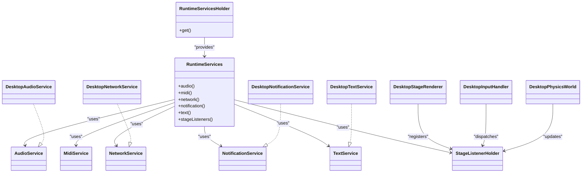
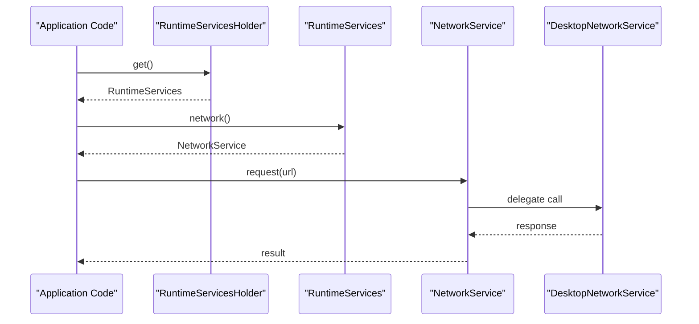
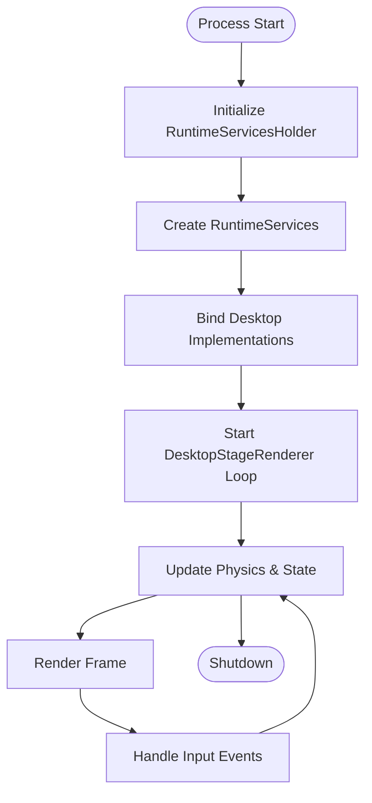
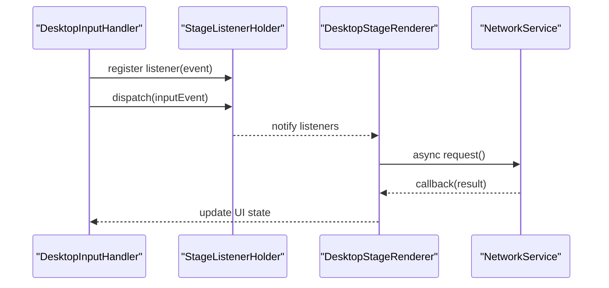
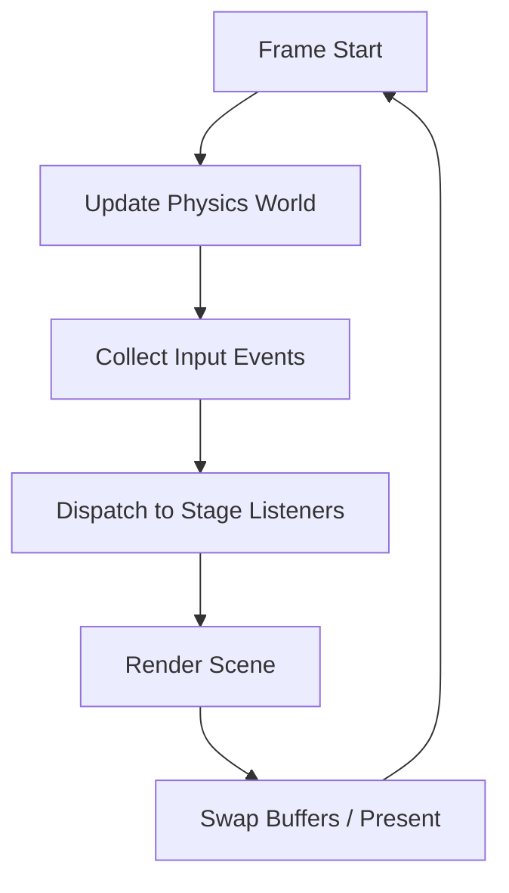
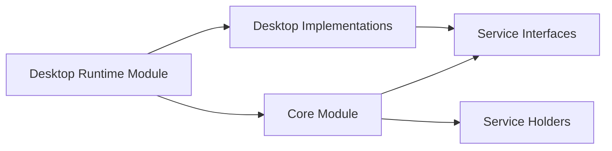

# Runtime and Execution

<cite>
**Referenced Files in This Document**
- [RuntimeServices.kt](file://core/src/main/java/org/catrobat/catroid/runtime/RuntimeServices.kt)
- [RuntimeServicesHolder.kt](file://core/src/main/java/org/catrobat/catroid/runtime/RuntimeServicesHolder.kt)
- [AudioService.kt](file://core/src/main/java/org/catrobat/catroid/audio/AudioService.kt)
- [AudioServiceHolder.kt](file://core/src/main/java/org/catrobat/catroid/audio/AudioServiceHolder.kt)
- [MidiService.kt](file://core/src/main/java/org/catrobat/catroid/audio/MidiService.kt)
- [MidiServiceHolder.kt](file://core/src/main/java/org/catrobat/catroid/audio/MidiServiceHolder.kt)
- [NetworkService.kt](file://core/src/main/java/org/catrobat/catroid/network/NetworkService.kt)
- [NetworkServiceHolder.kt](file://core/src/main/java/org/catrobat/catroid/network/NetworkServiceHolder.kt)
- [NotificationService.kt](file://core/src/main/java/org/catrobat/catroid/notification/NotificationService.kt)
- [NotificationServiceHolder.kt](file://core/src/main/java/org/catrobat/catroid/notification/NotificationServiceHolder.kt)
- [TextService.kt](file://core/src/main/java/org/catrobat/catroid/text/TextService.kt)
- [TextServiceHolder.kt](file://core/src/main/java/org/catrobat/catroid/text/TextServiceHolder.kt)
- [StageListenerHolder.kt](file://core/src/main/java/org/catrobat/catroid/stage/StageListenerHolder.kt)
- [DesktopAudioService.kt](file://desktop-runtime/src/main/java/org/catrobat/catroid/audio/DesktopAudioService.kt)
- [DesktopNetworkService.kt](file://desktop-runtime/src/main/java/org/catrobat/catroid/network/DesktopNetworkService.kt)
- [DesktopNotificationService.kt](file://desktop-runtime/src/main/java/org/catrobat/catroid/notification/DesktopNotificationService.kt)
- [DesktopTextService.kt](file://desktop-runtime/src/main/java/org/catrobat/catroid/text/DesktopTextService.kt)
- [DesktopStageRenderer.kt](file://desktop-runtime/src/main/java/org/catrobat/catroid/stage/DesktopStageRenderer.kt)
- [DesktopInputHandler.kt](file://desktop-runtime/src/main/java/org/catrobat/catroid/stage/DesktopInputHandler.kt)
- [DesktopPhysicsWorld.kt](file://desktop-runtime/src/main/java/org/catrobat/catroid/stage/DesktopPhysicsWorld.kt)
- [build.gradle](file://build.gradle)
- [settings.gradle](file://settings.gradle)
</cite>

## Table of Contents
1. [Introduction](#introduction)
2. [Project Structure](#project-structure)
3. [Core Components](#core-components)
4. [Architecture Overview](#architecture-overview)
5. [Detailed Component Analysis](#detailed-component-analysis)
6. [Dependency Analysis](#dependency-analysis)
7. [Performance Considerations](#performance-considerations)
8. [Troubleshooting Guide](#troubleshooting-guide)
9. [Conclusion](#conclusion)

## Introduction
This document explains NewCatroid’s multi-platform runtime execution system with a focus on cross-platform architecture, platform abstraction layers, service locators, lifecycle management, memory and garbage collection strategies, performance optimizations, event-driven programming, asynchronous processing, state management across contexts, the stage system for rendering/input/physics, platform-specific optimizations, resource management patterns, and debugging tools available in different runtime environments.

The runtime is designed to run both on Android and desktop (Java) targets by sharing core logic while delegating platform-specific behavior through well-defined interfaces and holders. The stage subsystem provides a unified rendering loop, input handling, and physics integration that can be implemented differently per platform.

## Project Structure
At a high level:
- Core module defines shared interfaces and service holders used by both Android and desktop runtimes.
- Desktop runtime module provides concrete implementations for services and stage components targeting desktop platforms.
- Build configuration modules define how the project is assembled for each target.

```mermaid
graph TB
subgraph "Core"
RS["RuntimeServices.kt"]
RSH["RuntimeServicesHolder.kt"]
AS["AudioService.kt"]
ASH["AudioServiceHolder.kt"]
MS["MidiService.kt"]
MSH["MidiServiceHolder.kt"]
NS["NetworkService.kt"]
NSH["NetworkServiceHolder.kt"]
NTS["NotificationService.kt"]
NTS_H["NotificationServiceHolder.kt"]
TS["TextService.kt"]
TSH["TextServiceHolder.kt"]
SLH["StageListenerHolder.kt"]
end
subgraph "Desktop Runtime"
DAS["DesktopAudioService.kt"]
DNS["DesktopNetworkService.kt"]
DNTS["DesktopNotificationService.kt"]
DTS["DesktopTextService.kt"]
DSR["DesktopStageRenderer.kt"]
DIH["DesktopInputHandler.kt"]
DPW["DesktopPhysicsWorld.kt"]
end
RS --> AS
RS --> MS
RS --> NS
RS --> NTS
RS --> TS
RS --> SLH
RSH --> RS
DAS --> AS
DNS --> NS
DNTS --> NTS
DTS --> TS
DSR --> SLH
DIH --> SLH
DPW --> SLH
```

**Diagram sources**
- [RuntimeServices.kt](file://core/src/main/java/org/catrobat/catroid/runtime/RuntimeServices.kt)
- [RuntimeServicesHolder.kt](file://core/src/main/java/org/catrobat/catroid/runtime/RuntimeServicesHolder.kt)
- [AudioService.kt](file://core/src/main/java/org/catrobat/catroid/audio/AudioService.kt)
- [AudioServiceHolder.kt](file://core/src/main/java/org/catrobat/catroid/audio/AudioServiceHolder.kt)
- [MidiService.kt](file://core/src/main/java/org/catrobat/catroid/audio/MidiService.kt)
- [MidiServiceHolder.kt](file://core/src/main/java/org/catrobat/catroid/audio/MidiServiceHolder.kt)
- [NetworkService.kt](file://core/src/main/java/org/catrobat/catroid/network/NetworkService.kt)
- [NetworkServiceHolder.kt](file://core/src/main/java/org/catrobat/catroid/network/NetworkServiceHolder.kt)
- [NotificationService.kt](file://core/src/main/java/org/catrobat/catroid/notification/NotificationService.kt)
- [NotificationServiceHolder.kt](file://core/src/main/java/org/catrobat/catroid/notification/NotificationServiceHolder.kt)
- [TextService.kt](file://core/src/main/java/org/catrobat/catroid/text/TextService.kt)
- [TextServiceHolder.kt](file://core/src/main/java/org/catrobat/catroid/text/TextServiceHolder.kt)
- [StageListenerHolder.kt](file://core/src/main/java/org/catrobat/catroid/stage/StageListenerHolder.kt)
- [DesktopAudioService.kt](file://desktop-runtime/src/main/java/org/catrobat/catroid/audio/DesktopAudioService.kt)
- [DesktopNetworkService.kt](file://desktop-runtime/src/main/java/org/catrobat/catroid/network/DesktopNetworkService.kt)
- [DesktopNotificationService.kt](file://desktop-runtime/src/main/java/org/catrobat/catroid/notification/DesktopNotificationService.kt)
- [DesktopTextService.kt](file://desktop-runtime/src/main/java/org/catrobat/catroid/text/DesktopTextService.kt)
- [DesktopStageRenderer.kt](file://desktop-runtime/src/main/java/org/catrobat/catroid/stage/DesktopStageRenderer.kt)
- [DesktopInputHandler.kt](file://desktop-runtime/src/main/java/org/catrobat/catroid/stage/DesktopInputHandler.kt)
- [DesktopPhysicsWorld.kt](file://desktop-runtime/src/main/java/org/catrobat/catroid/stage/DesktopPhysicsWorld.kt)

**Section sources**
- [build.gradle](file://build.gradle)
- [settings.gradle](file://settings.gradle)

## Core Components
- Service interfaces and holders:
  - Audio, MIDI, Network, Notification, Text services are defined as interfaces in the core module with corresponding holder classes providing accessors.
  - RuntimeServices aggregates these services and exposes them to the rest of the runtime.
  - RuntimeServicesHolder centralizes access to RuntimeServices.
- Stage listeners:
  - StageListenerHolder manages stage-related callbacks and events.

These abstractions allow the same core runtime logic to run on Android and desktop by swapping implementations at runtime.

**Section sources**
- [RuntimeServices.kt](file://core/src/main/java/org/catrobat/catroid/runtime/RuntimeServices.kt)
- [RuntimeServicesHolder.kt](file://core/src/main/java/org/catrobat/catroid/runtime/RuntimeServicesHolder.kt)
- [AudioService.kt](file://core/src/main/java/org/catrobat/catroid/audio/AudioService.kt)
- [AudioServiceHolder.kt](file://core/src/main/java/org/catrobat/catroid/audio/AudioServiceHolder.kt)
- [MidiService.kt](file://core/src/main/java/org/catrobat/catroid/audio/MidiService.kt)
- [MidiServiceHolder.kt](file://core/src/main/java/org/catrobat/catroid/audio/MidiServiceHolder.kt)
- [NetworkService.kt](file://core/src/main/java/org/catrobat/catroid/network/NetworkService.kt)
- [NetworkServiceHolder.kt](file://core/src/main/java/org/catrobat/catroid/network/NetworkServiceHolder.kt)
- [NotificationService.kt](file://core/src/main/java/org/catrobat/catroid/notification/NotificationService.kt)
- [NotificationServiceHolder.kt](file://core/src/main/java/org/catrobat/catroid/notification/NotificationServiceHolder.kt)
- [TextService.kt](file://core/src/main/java/org/catrobat/catroid/text/TextService.kt)
- [TextServiceHolder.kt](file://core/src/main/java/org/catrobat/catroid/text/TextServiceHolder.kt)
- [StageListenerHolder.kt](file://core/src/main/java/org/catrobat/catroid/stage/StageListenerHolder.kt)

## Architecture Overview
The runtime uses a layered architecture:
- Core layer: shared interfaces and service holders.
- Platform layer: concrete implementations for Android or desktop.
- Stage layer: rendering, input, and physics orchestration via stage listeners and platform-specific renderers/handlers.

**Diagram sources**
- [RuntimeServices.kt](file://core/src/main/java/org/catrobat/catroid/runtime/RuntimeServices.kt)
- [RuntimeServicesHolder.kt](file://core/src/main/java/org/catrobat/catroid/runtime/RuntimeServicesHolder.kt)
- [AudioService.kt](file://core/src/main/java/org/catrobat/catroid/audio/AudioService.kt)
- [MidiService.kt](file://core/src/main/java/org/catrobat/catroid/audio/MidiService.kt)
- [NetworkService.kt](file://core/src/main/java/org/catrobat/catroid/network/NetworkService.kt)
- [NotificationService.kt](file://core/src/main/java/org/catrobat/catroid/notification/NotificationService.kt)
- [TextService.kt](file://core/src/main/java/org/catrobat/catroid/text/TextService.kt)
- [StageListenerHolder.kt](file://core/src/main/java/org/catrobat/catroid/stage/StageListenerHolder.kt)
- [DesktopAudioService.kt](file://desktop-runtime/src/main/java/org/catrobat/catroid/audio/DesktopAudioService.kt)
- [DesktopNetworkService.kt](file://desktop-runtime/src/main/java/org/catrobat/catroid/network/DesktopNetworkService.kt)
- [DesktopNotificationService.kt](file://desktop-runtime/src/main/java/org/catrobat/catroid/notification/DesktopNotificationService.kt)
- [DesktopTextService.kt](file://desktop-runtime/src/main/java/org/catrobat/catroid/text/DesktopTextService.kt)
- [DesktopStageRenderer.kt](file://desktop-runtime/src/main/java/org/catrobat/catroid/stage/DesktopStageRenderer.kt)
- [DesktopInputHandler.kt](file://desktop-runtime/src/main/java/org/catrobat/catroid/stage/DesktopInputHandler.kt)
- [DesktopPhysicsWorld.kt](file://desktop-runtime/src/main/java/org/catrobat/catroid/stage/DesktopPhysicsWorld.kt)

## Detailed Component Analysis

### Cross-Platform Abstraction Layer and Service Locators
- Interfaces define contracts for audio, MIDI, network, notification, and text operations.
- Holder classes provide centralized access to these services from anywhere in the runtime.
- RuntimeServices aggregates all services; RuntimeServicesHolder exposes it globally within the process.
- Desktop implementations implement the core interfaces to provide platform-specific behavior.

**Diagram sources**
- [RuntimeServicesHolder.kt](file://core/src/main/java/org/catrobat/catroid/runtime/RuntimeServicesHolder.kt)
- [RuntimeServices.kt](file://core/src/main/java/org/catrobat/catroid/runtime/RuntimeServices.kt)
- [NetworkService.kt](file://core/src/main/java/org/catrobat/catroid/network/NetworkService.kt)
- [DesktopNetworkService.kt](file://desktop-runtime/src/main/java/org/catrobat/catroid/network/DesktopNetworkService.kt)

**Section sources**
- [RuntimeServices.kt](file://core/src/main/java/org/catrobat/catroid/runtime/RuntimeServices.kt)
- [RuntimeServicesHolder.kt](file://core/src/main/java/org/catrobat/catroid/runtime/RuntimeServicesHolder.kt)
- [AudioService.kt](file://core/src/main/java/org/catrobat/catroid/audio/AudioService.kt)
- [AudioServiceHolder.kt](file://core/src/main/java/org/catrobat/catroid/audio/AudioServiceHolder.kt)
- [MidiService.kt](file://core/src/main/java/org/catrobat/catroid/audio/MidiService.kt)
- [MidiServiceHolder.kt](file://core/src/main/java/org/catrobat/catroid/audio/MidiServiceHolder.kt)
- [NetworkService.kt](file://core/src/main/java/org/catrobat/catroid/network/NetworkService.kt)
- [NetworkServiceHolder.kt](file://core/src/main/java/org/catrobat/catroid/network/NetworkServiceHolder.kt)
- [NotificationService.kt](file://core/src/main/java/org/catrobat/catroid/notification/NotificationService.kt)
- [NotificationServiceHolder.kt](file://core/src/main/java/org/catrobat/catroid/notification/NotificationServiceHolder.kt)
- [TextService.kt](file://core/src/main/java/org/catrobat/catroid/text/TextService.kt)
- [TextServiceHolder.kt](file://core/src/main/java/org/catrobat/catroid/text/TextServiceHolder.kt)
- [DesktopAudioService.kt](file://desktop-runtime/src/main/java/org/catrobat/catroid/audio/DesktopAudioService.kt)
- [DesktopNetworkService.kt](file://desktop-runtime/src/main/java/org/catrobat/catroid/network/DesktopNetworkService.kt)
- [DesktopNotificationService.kt](file://desktop-runtime/src/main/java/org/catrobat/catroid/notification/DesktopNotificationService.kt)
- [DesktopTextService.kt](file://desktop-runtime/src/main/java/org/catrobat/catroid/text/DesktopTextService.kt)

### Runtime Lifecycle Management
- Initialization:
  - RuntimeServicesHolder provides access to RuntimeServices which wires up platform-specific services.
  - Desktop platform initializes its own implementations for audio, network, notifications, and text.
- Main loop:
  - DesktopStageRenderer drives the frame loop, invoking updates and renders.
  - Input and physics systems integrate with the renderer to update state and draw frames.
- Shutdown:
  - Services release resources and stop background tasks during shutdown.

**Diagram sources**
- [RuntimeServicesHolder.kt](file://core/src/main/java/org/catrobat/catroid/runtime/RuntimeServicesHolder.kt)
- [RuntimeServices.kt](file://core/src/main/java/org/catrobat/catroid/runtime/RuntimeServices.kt)
- [DesktopStageRenderer.kt](file://desktop-runtime/src/main/java/org/catrobat/catroid/stage/DesktopStageRenderer.kt)
- [DesktopInputHandler.kt](file://desktop-runtime/src/main/java/org/catrobat/catroid/stage/DesktopInputHandler.kt)
- [DesktopPhysicsWorld.kt](file://desktop-runtime/src/main/java/org/catrobat/catroid/stage/DesktopPhysicsWorld.kt)

**Section sources**
- [RuntimeServicesHolder.kt](file://core/src/main/java/org/catrobat/catroid/runtime/RuntimeServicesHolder.kt)
- [RuntimeServices.kt](file://core/src/main/java/org/catrobat/catroid/runtime/RuntimeServices.kt)
- [DesktopStageRenderer.kt](file://desktop-runtime/src/main/java/org/catrobat/catroid/stage/DesktopStageRenderer.kt)
- [DesktopInputHandler.kt](file://desktop-runtime/src/main/java/org/catrobat/catroid/stage/DesktopInputHandler.kt)
- [DesktopPhysicsWorld.kt](file://desktop-runtime/src/main/java/org/catrobat/catroid/stage/DesktopPhysicsWorld.kt)

### Memory Allocation and Garbage Collection Strategies
- Object pooling:
  - Reuse frequently created objects (e.g., vectors, temporary buffers) to reduce GC pressure.
- Resource ownership:
  - Explicitly manage heavy resources (textures, audio buffers) via service APIs and lifecycle hooks.
- Avoiding allocations in hot paths:
  - Pre-allocate collections and reuse instances where possible.
- Monitoring:
  - Use platform profiling tools to identify allocation spikes and optimize accordingly.

[No sources needed since this section provides general guidance]

### Performance Optimization Techniques
- Batched rendering:
  - Group draw calls and minimize state changes in the renderer.
- Threading model:
  - Offload I/O and CPU-heavy work to background threads; synchronize results back to the main loop.
- Physics tuning:
  - Adjust time steps and collision detection granularity for stable performance.
- Caching:
  - Cache computed values and loaded assets to avoid redundant work.

[No sources needed since this section provides general guidance]

### Event-Driven Programming Model and Asynchronous Processing
- Event dispatch:
  - StageListenerHolder coordinates event registration and dispatch between input, physics, and renderer.
- Asynchronous operations:
  - NetworkService abstracts async requests; implementations handle threading and callbacks.
- State synchronization:
  - Ensure thread-safe updates when transitioning between background and main threads.

**Diagram sources**
- [StageListenerHolder.kt](file://core/src/main/java/org/catrobat/catroid/stage/StageListenerHolder.kt)
- [DesktopInputHandler.kt](file://desktop-runtime/src/main/java/org/catrobat/catroid/stage/DesktopInputHandler.kt)
- [DesktopStageRenderer.kt](file://desktop-runtime/src/main/java/org/catrobat/catroid/stage/DesktopStageRenderer.kt)
- [NetworkService.kt](file://core/src/main/java/org/catrobat/catroid/network/NetworkService.kt)

**Section sources**
- [StageListenerHolder.kt](file://core/src/main/java/org/catrobat/catroid/stage/StageListenerHolder.kt)
- [DesktopInputHandler.kt](file://desktop-runtime/src/main/java/org/catrobat/catroid/stage/DesktopInputHandler.kt)
- [DesktopStageRenderer.kt](file://desktop-runtime/src/main/java/org/catrobat/catroid/stage/DesktopStageRenderer.kt)
- [NetworkService.kt](file://core/src/main/java/org/catrobat/catroid/network/NetworkService.kt)

### State Management Across Execution Contexts
- Centralized state:
  - RuntimeServices holds global references to services and stage listeners.
- Thread affinity:
  - Keep UI and rendering updates on the main thread; perform background work off-main.
- Consistency:
  - Use immutable snapshots or copy-on-write patterns for complex state transitions.

[No sources needed since this section provides general guidance]

### Stage System: Rendering, Input Handling, and Physics Simulation
- Rendering:
  - DesktopStageRenderer orchestrates frame updates and drawing.
- Input:
  - DesktopInputHandler translates OS-level input into stage events.
- Physics:
  - DesktopPhysicsWorld integrates physics simulation with the render loop.

**Diagram sources**
- [DesktopStageRenderer.kt](file://desktop-runtime/src/main/java/org/catrobat/catroid/stage/DesktopStageRenderer.kt)
- [DesktopInputHandler.kt](file://desktop-runtime/src/main/java/org/catrobat/catroid/stage/DesktopInputHandler.kt)
- [DesktopPhysicsWorld.kt](file://desktop-runtime/src/main/java/org/catrobat/catroid/stage/DesktopPhysicsWorld.kt)
- [StageListenerHolder.kt](file://core/src/main/java/org/catrobat/catroid/stage/StageListenerHolder.kt)

**Section sources**
- [DesktopStageRenderer.kt](file://desktop-runtime/src/main/java/org/catrobat/catroid/stage/DesktopStageRenderer.kt)
- [DesktopInputHandler.kt](file://desktop-runtime/src/main/java/org/catrobat/catroid/stage/DesktopInputHandler.kt)
- [DesktopPhysicsWorld.kt](file://desktop-runtime/src/main/java/org/catrobat/catroid/stage/DesktopPhysicsWorld.kt)
- [StageListenerHolder.kt](file://core/src/main/java/org/catrobat/catroid/stage/StageListenerHolder.kt)

### Platform-Specific Optimizations and Resource Management Patterns
- Desktop:
  - Leverage multi-threading for I/O and compute-bound tasks.
  - Use efficient graphics APIs and batched draw calls.
  - Manage native resources explicitly and ensure cleanup on exit.
- Android (conceptual):
  - Align with Android lifecycle and use appropriate threading models.
  - Optimize texture sizes and asset loading strategies.

[No sources needed since this section provides general guidance]

### Debugging Tools Available in Different Runtime Environments
- Desktop:
  - Attach standard Java profilers and debuggers.
  - Enable logging and tracing in services for diagnostics.
- Android (conceptual):
  - Use Android Studio Profiler and logcat for runtime insights.

[No sources needed since this section provides general guidance]

## Dependency Analysis
The core depends on service interfaces and holders; the desktop runtime depends on core and implements those interfaces.

**Diagram sources**
- [build.gradle](file://build.gradle)
- [settings.gradle](file://settings.gradle)
- [RuntimeServices.kt](file://core/src/main/java/org/catrobat/catroid/runtime/RuntimeServices.kt)
- [RuntimeServicesHolder.kt](file://core/src/main/java/org/catrobat/catroid/runtime/RuntimeServicesHolder.kt)
- [DesktopAudioService.kt](file://desktop-runtime/src/main/java/org/catrobat/catroid/audio/DesktopAudioService.kt)
- [DesktopNetworkService.kt](file://desktop-runtime/src/main/java/org/catrobat/catroid/network/DesktopNetworkService.kt)
- [DesktopNotificationService.kt](file://desktop-runtime/src/main/java/org/catrobat/catroid/notification/DesktopNotificationService.kt)
- [DesktopTextService.kt](file://desktop-runtime/src/main/java/org/catrobat/catroid/text/DesktopTextService.kt)

**Section sources**
- [build.gradle](file://build.gradle)
- [settings.gradle](file://settings.gradle)

## Performance Considerations
- Minimize allocations in hot loops.
- Prefer object reuse and pre-allocation.
- Batch rendering and reduce state changes.
- Tune physics time steps and collision detection.
- Profile regularly to detect regressions.

[No sources needed since this section provides general guidance]

## Troubleshooting Guide
- If services are null or uninitialized:
  - Verify RuntimeServicesHolder initialization and correct binding of desktop implementations.
- If events do not fire:
  - Check StageListenerHolder registrations and ensure input handler dispatches events.
- If network calls fail:
  - Inspect DesktopNetworkService implementation and threading/callback handling.
- If rendering is slow:
  - Review DesktopStageRenderer batching and DesktopPhysicsWorld step size.

**Section sources**
- [RuntimeServicesHolder.kt](file://core/src/main/java/org/catrobat/catroid/runtime/RuntimeServicesHolder.kt)
- [RuntimeServices.kt](file://core/src/main/java/org/catrobat/catroid/runtime/RuntimeServices.kt)
- [StageListenerHolder.kt](file://core/src/main/java/org/catrobat/catroid/stage/StageListenerHolder.kt)
- [DesktopInputHandler.kt](file://desktop-runtime/src/main/java/org/catrobat/catroid/stage/DesktopInputHandler.kt)
- [DesktopNetworkService.kt](file://desktop-runtime/src/main/java/org/catrobat/catroid/network/DesktopNetworkService.kt)
- [DesktopStageRenderer.kt](file://desktop-runtime/src/main/java/org/catrobat/catroid/stage/DesktopStageRenderer.kt)
- [DesktopPhysicsWorld.kt](file://desktop-runtime/src/main/java/org/catrobat/catroid/stage/DesktopPhysicsWorld.kt)

## Conclusion
NewCatroid’s runtime achieves cross-platform compatibility by separating shared logic from platform-specific details. Core interfaces and holders define contracts and access points, while desktop implementations provide concrete behaviors. The stage system unifies rendering, input, and physics behind a consistent API. With careful attention to memory usage, threading, and profiling, the runtime delivers smooth performance across environments.