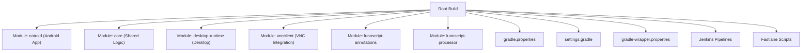
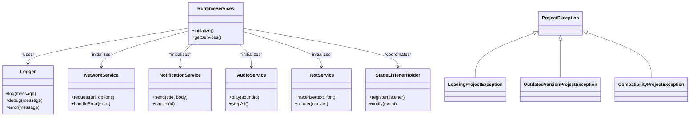
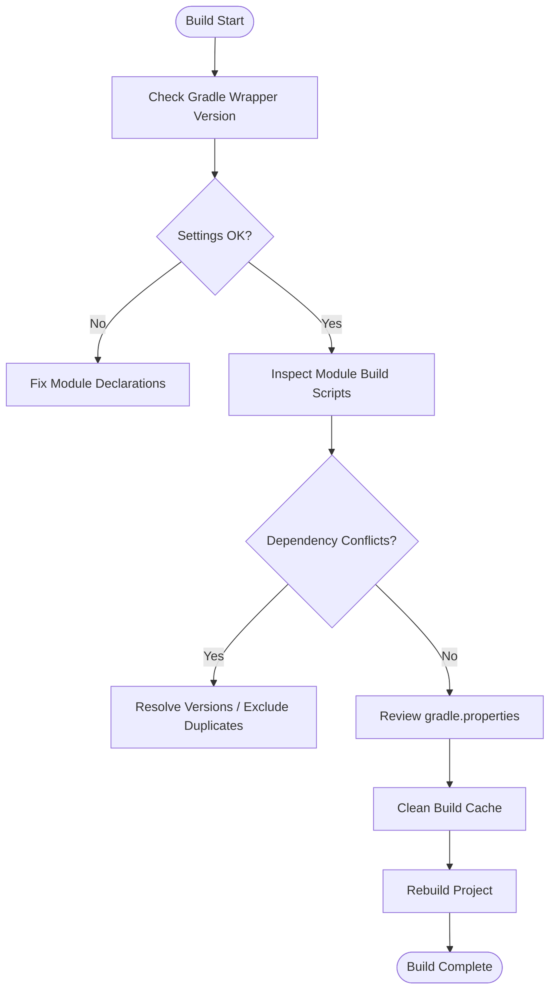
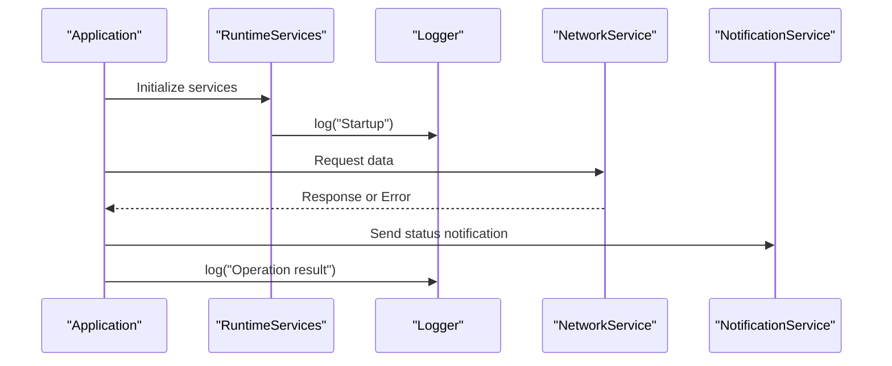
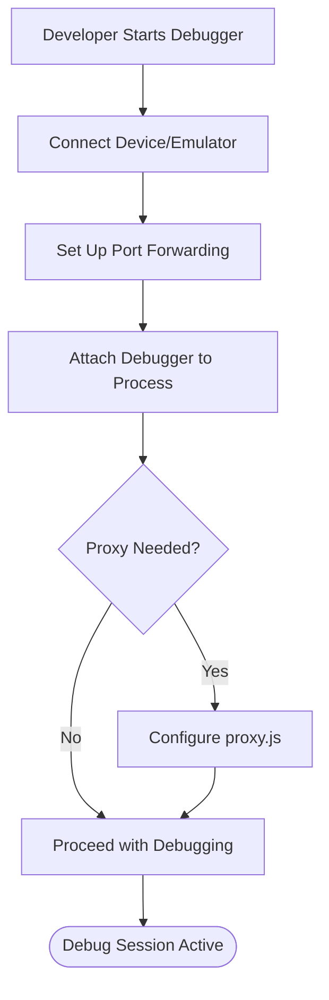
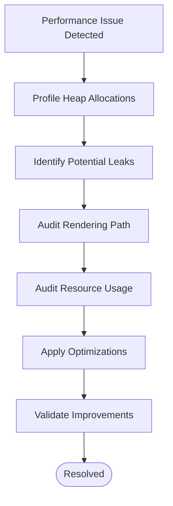
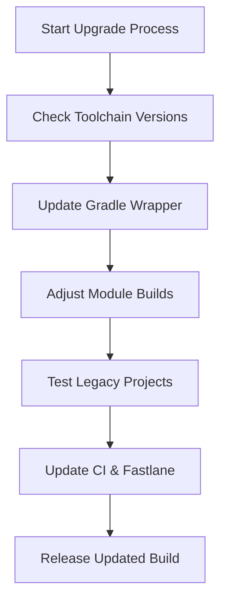
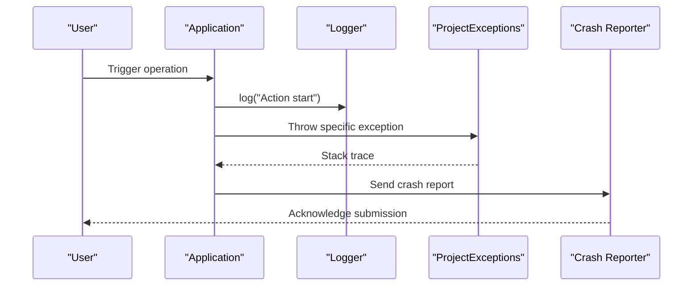
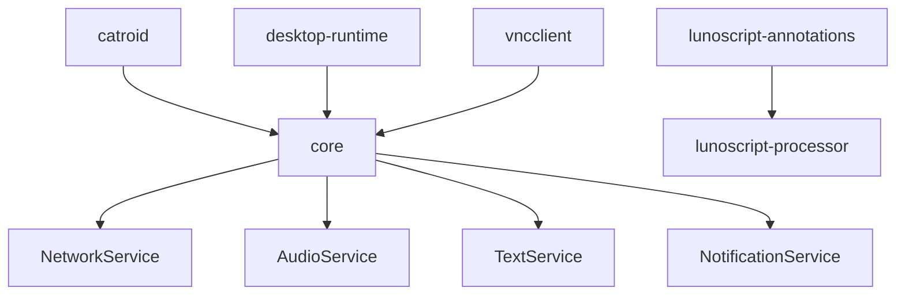

# Troubleshooting and FAQ

<cite>
**Referenced Files in This Document**
- [README.md](file://README.md)
- [build.gradle](file://build.gradle)
- [settings.gradle](file://settings.gradle)
- [gradle.properties](file://gradle.properties)
- [catroid/build.gradle](file://catroid/build.gradle)
- [core/build.gradle](file://core/build.gradle)
- [desktop-runtime/build.gradle](file://desktop-runtime/build.gradle)
- [vncclient/build.gradle](file://vncclient/build.gradle)
- [lunoscript-annotations/build.gradle](file://lunoscript-annotations/build.gradle)
- [lunoscript-processor/build.gradle](file://lunoscript-processor/build.gradle)
- [gradle/wrapper/gradle-wrapper.properties](file://gradle/wrapper/gradle-wrapper.properties)
- [Jenkinsfile](file://Jenkinsfile)
- [Jenkinsfile.BuildStandalone](file://Jenkinsfile.BuildStandalone)
- [Jenkinsfile.ManualTests](file://Jenkinsfile.ManualTests)
- [Jenkinsfile.OutgoingNetworkCallsTests](file://Jenkinsfile.OutgoingNetworkCallsTests)
- [Jenkinsfile.SensorboxTests](file://Jenkinsfile.SensorboxTests)
- [Jenkinsfile.baseDocker](file://Jenkinsfile.baseDocker)
- [Jenkinsfile.buildMetadata](file://Jenkinsfile.buildMetadata)
- [Jenkinsfile.releaseAPK](file://Jenkinsfile.releaseAPK)
- [proxy.js](file://proxy.js)
- [package.json](file://package.json)
- [catroid/src/main/AndroidManifest.xml](file://catroid/src/main/AndroidManifest.xml)
- [core/src/main/java/org/catrobat/catroid/util/Logger.kt](file://core/src/main/java/org/catrobat/catroid/util/Logger.kt)
- [core/src/main/java/org/catrobat/catroid/runtime/RuntimeServices.kt](file://core/src/main/java/org/catrobat/catroid/runtime/RuntimeServices.kt)
- [core/src/main/java/org/catrobat/catroid/network/NetworkService.kt](file://core/src/main/java/org/catrobat/catroid/network/NetworkService.kt)
- [core/src/main/java/org/catrobat/catroid/notification/NotificationService.kt](file://core/src/main/java/org/catrobat/catroid/notification/NotificationService.kt)
- [core/src/main/java/org/catrobat/catroid/audio/AudioService.kt](file://core/src/main/java/org/catrobat/catroid/audio/AudioService.kt)
- [core/src/main/java/org/catrobat/catroid/text/TextService.kt](file://core/src/main/java/org/catrobat/catroid/text/TextService.kt)
- [core/src/main/java/org/catrobat/catroid/stage/StageListenerHolder.kt](file://core/src/main/java/org/catrobat/catroid/stage/StageListenerHolder.kt)
- [core/src/main/java/org/catrobat/catroid/content/notification/NotificationStorage.kt](file://core/src/main/java/org/catrobat/catroid/content/notification/NotificationStorage.kt)
- [core/src/main/java/org/catrobat/catroid/pocketmusic/note/Drum.java](file://core/src/main/java/org/catrobat/catroid/pocketmusic/note/Drum.java)
- [core/src/main/java/org/catrobat/catroid/pocketmusic/note/MusicalInstrument.java](file://core/src/main/java/org/catrobat/catroid/pocketmusic/note/MusicalInstrument.java)
- [core/src/main/java/org/catrobat/catroid/exceptions/ProjectException.java](file://core/src/main/java/org/catrobat/catroid/exceptions/ProjectException.java)
- [core/src/main/java/org/catrobat/catroid/exceptions/LoadingProjectException.java](file://core/src/main/java/org/catrobat/catroid/exceptions/LoadingProjectException.java)
- [core/src/main/java/org/catrobat/catroid/exceptions/OutdatedVersionProjectException.java](file://core/src/main/java/org/catrobat/catroid/exceptions/OutdatedVersionProjectException.java)
- [core/src/main/java/org/catrobat/catroid/exceptions/CompatibilityProjectException.java](file://core/src/main/java/org/catrobat/catroid/exceptions/CompatibilityProjectException.java)
- [catroid/src/androidTest/resources/robolectric.properties](file://catroid/src/androidTest/resources/robolectric.properties)
- [fastlane/Fastfile](file://fastlane/Fastfile)
- [fastlane/Appfile](file://fastlane/Appfile)
- [crowdin.yml](file://crowdin.yml)
- [.github/PULL_REQUEST_TEMPLATE.md](file://.github/PULL_REQUEST_TEMPLATE.md)
</cite>

## Table of Contents
1. Introduction
2. Project Structure
3. Core Components
4. Architecture Overview
5. Detailed Component Analysis
6. Dependency Analysis
7. Performance Considerations
8. Troubleshooting Guide
9. Conclusion
10. Appendices

## Introduction
This document provides comprehensive troubleshooting guidance for NewCatroid, focusing on common build problems (Gradle configuration, dependency conflicts, compilation errors), runtime error diagnosis, log analysis, remote debugging setup, performance issues (memory leaks, slow rendering, resource exhaustion), migration guides for version upgrades, legacy project compatibility, breaking changes, diagnostic tools usage, crash report analysis, and community support resources. It is organized by problem categories with step-by-step resolution procedures to help both new and experienced contributors resolve issues efficiently.

## Project Structure
NewCatroid is a multi-module Android and desktop runtime project using Gradle. The top-level build orchestrates modules including catroid (Android app), core (shared logic), desktop-runtime (desktop environment), vncclient (VNC integration), and several utility modules. Configuration files such as gradle.properties, settings.gradle, and wrapper properties control the build toolchain and behavior. CI pipelines are defined via Jenkinsfiles, and Fastlane automates release artifacts.

**Diagram sources**
- [build.gradle](file://build.gradle)
- [settings.gradle](file://settings.gradle)
- [gradle.properties](file://gradle.properties)
- [gradle/wrapper/gradle-wrapper.properties](file://gradle/wrapper/gradle-wrapper.properties)
- [Jenkinsfile](file://Jenkinsfile)
- [fastlane/Fastfile](file://fastlane/Fastfile)

**Section sources**
- [README.md](file://README.md)
- [build.gradle](file://build.gradle)
- [settings.gradle](file://settings.gradle)
- [gradle.properties](file://gradle.properties)
- [gradle/wrapper/gradle-wrapper.properties](file://gradle/wrapper/gradle-wrapper.properties)

## Core Components
Key runtime services and utilities used across modules include logging, network access, notifications, audio, text rendering, stage listeners, and exception types for project loading and compatibility. These components are central to diagnosing runtime issues and understanding error propagation paths.

- Logging: centralized logger for consistent diagnostics
- Runtime services: initialization and lifecycle management
- Network service: HTTP client configuration and error handling
- Notification service: system notification integration
- Audio service: audio playback and MIDI handling
- Text service: rasterized text rendering
- Stage listener holder: event coordination for stage operations
- Exception hierarchy: project loading and compatibility errors

**Section sources**
- [core/src/main/java/org/catrobat/catroid/util/Logger.kt](file://core/src/main/java/org/catrobat/catroid/util/Logger.kt)
- [core/src/main/java/org/catrobat/catroid/runtime/RuntimeServices.kt](file://core/src/main/java/org/catrobat/catroid/runtime/RuntimeServices.kt)
- [core/src/main/java/org/catrobat/catroid/network/NetworkService.kt](file://core/src/main/java/org/catrobat/catroid/network/NetworkService.kt)
- [core/src/main/java/org/catrobat/catroid/notification/NotificationService.kt](file://core/src/main/java/org/catrobat/catroid/notification/NotificationService.kt)
- [core/src/main/java/org/catrobat/catroid/audio/AudioService.kt](file://core/src/main/java/org/catrobat/catroid/audio/AudioService.kt)
- [core/src/main/java/org/catrobat/catroid/text/TextService.kt](file://core/src/main/java/org/catrobat/catroid/text/TextService.kt)
- [core/src/main/java/org/catrobat/catroid/stage/StageListenerHolder.kt](file://core/src/main/java/org/catrobat/catroid/stage/StageListenerHolder.kt)
- [core/src/main/java/org/catrobat/catroid/exceptions/ProjectException.java](file://core/src/main/java/org/catrobat/catroid/exceptions/ProjectException.java)
- [core/src/main/java/org/catrobat/catroid/exceptions/LoadingProjectException.java](file://core/src/main/java/org/catrobat/catroid/exceptions/LoadingProjectException.java)
- [core/src/main/java/org/catrobat/catroid/exceptions/OutdatedVersionProjectException.java](file://core/src/main/java/org/catrobat/catroid/exceptions/OutdatedVersionProjectException.java)
- [core/src/main/java/org/catrobat/catroid/exceptions/CompatibilityProjectException.java](file://core/src/main/java/org/catrobat/catroid/exceptions/CompatibilityProjectException.java)

## Architecture Overview
The runtime architecture centers around shared services that coordinate application behavior across Android and desktop environments. Services initialize at startup, expose APIs to UI and stage logic, and handle cross-cutting concerns like networking and notifications.

**Diagram sources**
- [core/src/main/java/org/catrobat/catroid/util/Logger.kt](file://core/src/main/java/org/catrobat/catroid/util/Logger.kt)
- [core/src/main/java/org/catrobat/catroid/runtime/RuntimeServices.kt](file://core/src/main/java/org/catrobat/catroid/runtime/RuntimeServices.kt)
- [core/src/main/java/org/catrobat/catroid/network/NetworkService.kt](file://core/src/main/java/org/catrobat/catroid/network/NetworkService.kt)
- [core/src/main/java/org/catrobat/catroid/notification/NotificationService.kt](file://core/src/main/java/org/catrobat/catroid/notification/NotificationService.kt)
- [core/src/main/java/org/catrobat/catroid/audio/AudioService.kt](file://core/src/main/java/org/catrobat/catroid/audio/AudioService.kt)
- [core/src/main/java/org/catrobat/catroid/text/TextService.kt](file://core/src/main/java/org/catrobat/catroid/text/TextService.kt)
- [core/src/main/java/org/catrobat/catroid/stage/StageListenerHolder.kt](file://core/src/main/java/org/catrobat/catroid/stage/StageListenerHolder.kt)
- [core/src/main/java/org/catrobat/catroid/exceptions/ProjectException.java](file://core/src/main/java/org/catrobat/catroid/exceptions/ProjectException.java)
- [core/src/main/java/org/catrobat/catroid/exceptions/LoadingProjectException.java](file://core/src/main/java/org/catrobat/catroid/exceptions/LoadingProjectException.java)
- [core/src/main/java/org/catrobat/catroid/exceptions/OutdatedVersionProjectException.java](file://core/src/main/java/org/catrobat/catroid/exceptions/OutdatedVersionProjectException.java)
- [core/src/main/java/org/catrobat/catroid/exceptions/CompatibilityProjectException.java](file://core/src/main/java/org/catrobat/catroid/exceptions/CompatibilityProjectException.java)

## Detailed Component Analysis

### Build System and Gradle Configuration
Common build issues stem from Gradle version mismatches, incorrect module declarations, or missing dependencies. Verify the wrapper version and ensure all modules are included in settings. Check per-module build scripts for conflicting configurations.

- Validate Gradle wrapper version and distribution URL
- Ensure all modules are declared in settings.gradle
- Inspect module-specific build.gradle for dependency conflicts
- Review global gradle.properties for JVM args and caching flags

**Diagram sources**
- [gradle/wrapper/gradle-wrapper.properties](file://gradle/wrapper/gradle-wrapper.properties)
- [settings.gradle](file://settings.gradle)
- [build.gradle](file://build.gradle)
- [catroid/build.gradle](file://catroid/build.gradle)
- [core/build.gradle](file://core/build.gradle)
- [desktop-runtime/build.gradle](file://desktop-runtime/build.gradle)
- [vncclient/build.gradle](file://vncclient/build.gradle)
- [lunoscript-annotations/build.gradle](file://lunoscript-annotations/build.gradle)
- [lunoscript-processor/build.gradle](file://lunoscript-processor/build.gradle)
- [gradle.properties](file://gradle.properties)

**Section sources**
- [gradle/wrapper/gradle-wrapper.properties](file://gradle/wrapper/gradle-wrapper.properties)
- [settings.gradle](file://settings.gradle)
- [build.gradle](file://build.gradle)
- [catroid/build.gradle](file://catroid/build.gradle)
- [core/build.gradle](file://core/build.gradle)
- [desktop-runtime/build.gradle](file://desktop-runtime/build.gradle)
- [vncclient/build.gradle](file://vncclient/build.gradle)
- [lunoscript-annotations/build.gradle](file://lunoscript-annotations/build.gradle)
- [lunoscript-processor/build.gradle](file://lunoscript-processor/build.gradle)
- [gradle.properties](file://gradle.properties)

### Runtime Error Diagnosis and Log Analysis
Use the centralized logger to capture structured logs during runtime. Focus on exceptions thrown by project loading and compatibility checks. Correlate logs with network calls and notification events to identify failure points.

- Enable verbose logging for critical services
- Filter logs by tags for Logger, NetworkService, NotificationService, AudioService, TextService
- Investigate ProjectException subclasses for project load failures
- Cross-reference timestamps with network request logs

**Diagram sources**
- [core/src/main/java/org/catrobat/catroid/util/Logger.kt](file://core/src/main/java/org/catrobat/catroid/util/Logger.kt)
- [core/src/main/java/org/catrobat/catroid/runtime/RuntimeServices.kt](file://core/src/main/java/org/catrobat/catroid/runtime/RuntimeServices.kt)
- [core/src/main/java/org/catrobat/catroid/network/NetworkService.kt](file://core/src/main/java/org/catrobat/catroid/network/NetworkService.kt)
- [core/src/main/java/org/catrobat/catroid/notification/NotificationService.kt](file://core/src/main/java/org/catrobat/catroid/notification/NotificationService.kt)

**Section sources**
- [core/src/main/java/org/catrobat/catroid/util/Logger.kt](file://core/src/main/java/org/catrobat/catroid/util/Logger.kt)
- [core/src/main/java/org/catrobat/catroid/runtime/RuntimeServices.kt](file://core/src/main/java/org/catrobat/catroid/runtime/RuntimeServices.kt)
- [core/src/main/java/org/catrobat/catroid/network/NetworkService.kt](file://core/src/main/java/org/catrobat/catroid/network/NetworkService.kt)
- [core/src/main/java/org/catrobat/catroid/notification/NotificationService.kt](file://core/src/main/java/org/catrobat/catroid/notification/NotificationService.kt)
- [core/src/main/java/org/catrobat/catroid/exceptions/ProjectException.java](file://core/src/main/java/org/catrobat/catroid/exceptions/ProjectException.java)
- [core/src/main/java/org/catrobat/catroid/exceptions/LoadingProjectException.java](file://core/src/main/java/org/catrobat/catroid/exceptions/LoadingProjectException.java)
- [core/src/main/java/org/catrobat/catroid/exceptions/OutdatedVersionProjectException.java](file://core/src/main/java/org/catrobat/catroid/exceptions/OutdatedVersionProjectException.java)
- [core/src/main/java/org/catrobat/catroid/exceptions/CompatibilityProjectException.java](file://core/src/main/java/org/catrobat/catroid/exceptions/CompatibilityProjectException.java)

### Remote Debugging Setup
Remote debugging can be facilitated through standard Android debugging mechanisms and custom proxies if needed. Ensure device connectivity and verify port forwarding. For desktop builds, use IDE debuggers with appropriate run configurations.

- Confirm ADB connection and device state
- Attach debugger to running process
- Use proxy.js for intercepting network requests when necessary
- Validate manifest permissions for network and storage access

**Diagram sources**
- [proxy.js](file://proxy.js)
- [catroid/src/main/AndroidManifest.xml](file://catroid/src/main/AndroidManifest.xml)

**Section sources**
- [proxy.js](file://proxy.js)
- [catroid/src/main/AndroidManifest.xml](file://catroid/src/main/AndroidManifest.xml)

### Performance Issues: Memory Leaks, Slow Rendering, Resource Exhaustion
Identify memory leaks by monitoring allocations and object retention. Optimize rendering by reducing overdraw and offloading heavy tasks. Prevent resource exhaustion by managing file handles, network connections, and audio streams.

- Use profiling tools to track heap growth and GC activity
- Audit TextService rasterization and canvas operations
- Monitor AudioService stream lifecycle and stop unused sounds
- Limit concurrent network requests and implement backoff strategies

[No sources needed since this section provides general guidance]

### Migration Guides and Breaking Changes
When upgrading versions, review Gradle toolchain updates, Android SDK changes, and module API modifications. Update wrapper properties, adjust build scripts for deprecated features, and test compatibility with existing projects.

- Update gradle-wrapper.properties to recommended versions
- Review module build.gradle for deprecated plugins and APIs
- Test legacy project loading with updated exception handling
- Validate CI pipelines and Fastlane scripts for compatibility

**Diagram sources**
- [gradle/wrapper/gradle-wrapper.properties](file://gradle/wrapper/gradle-wrapper.properties)
- [build.gradle](file://build.gradle)
- [catroid/build.gradle](file://catroid/build.gradle)
- [core/build.gradle](file://core/build.gradle)
- [desktop-runtime/build.gradle](file://desktop-runtime/build.gradle)
- [vncclient/build.gradle](file://vncclient/build.gradle)
- [lunoscript-annotations/build.gradle](file://lunoscript-annotations/build.gradle)
- [lunoscript-processor/build.gradle](file://lunoscript-processor/build.gradle)
- [Jenkinsfile](file://Jenkinsfile)
- [fastlane/Fastfile](file://fastlane/Fastfile)

**Section sources**
- [gradle/wrapper/gradle-wrapper.properties](file://gradle/wrapper/gradle-wrapper.properties)
- [build.gradle](file://build.gradle)
- [catroid/build.gradle](file://catroid/build.gradle)
- [core/build.gradle](file://core/build.gradle)
- [desktop-runtime/build.gradle](file://desktop-runtime/build.gradle)
- [vncclient/build.gradle](file://vncclient/build.gradle)
- [lunoscript-annotations/build.gradle](file://lunoscript-annotations/build.gradle)
- [lunoscript-processor/build.gradle](file://lunoscript-processor/build.gradle)
- [Jenkinsfile](file://Jenkinsfile)
- [fastlane/Fastfile](file://fastlane/Fastfile)

### Diagnostic Tools Usage and Crash Report Analysis
Leverage built-in logging and external tools to diagnose crashes. Collect stack traces from ProjectException subclasses and correlate with network and notification logs. Use Robolectric properties for unit tests to simulate environments.

- Enable detailed logging before reproducing issues
- Capture crash reports and analyze stack traces
- Use Robolectric configuration to reproduce UI-related failures
- Submit reports with environment details and steps to reproduce

**Diagram sources**
- [core/src/main/java/org/catrobat/catroid/util/Logger.kt](file://core/src/main/java/org/catrobat/catroid/util/Logger.kt)
- [core/src/main/java/org/catrobat/catroid/exceptions/ProjectException.java](file://core/src/main/java/org/catrobat/catroid/exceptions/ProjectException.java)
- [core/src/main/java/org/catrobat/catroid/exceptions/LoadingProjectException.java](file://core/src/main/java/org/catrobat/catroid/exceptions/LoadingProjectException.java)
- [core/src/main/java/org/catrobat/catroid/exceptions/OutdatedVersionProjectException.java](file://core/src/main/java/org/catrobat/catroid/exceptions/OutdatedVersionProjectException.java)
- [core/src/main/java/org/catrobat/catroid/exceptions/CompatibilityProjectException.java](file://core/src/main/java/org/catrobat/catroid/exceptions/CompatibilityProjectException.java)
- [catroid/src/androidTest/resources/robolectric.properties](file://catroid/src/androidTest/resources/robolectric.properties)

**Section sources**
- [core/src/main/java/org/catrobat/catroid/util/Logger.kt](file://core/src/main/java/org/catrobat/catroid/util/Logger.kt)
- [core/src/main/java/org/catrobat/catroid/exceptions/ProjectException.java](file://core/src/main/java/org/catrobat/catroid/exceptions/ProjectException.java)
- [core/src/main/java/org/catrobat/catroid/exceptions/LoadingProjectException.java](file://core/src/main/java/org/catrobat/catroid/exceptions/LoadingProjectException.java)
- [core/src/main/java/org/catrobat/catroid/exceptions/OutdatedVersionProjectException.java](file://core/src/main/java/org/catrobat/catroid/exceptions/OutdatedVersionProjectException.java)
- [core/src/main/java/org/catrobat/catroid/exceptions/CompatibilityProjectException.java](file://core/src/main/java/org/catrobat/catroid/exceptions/CompatibilityProjectException.java)
- [catroid/src/androidTest/resources/robolectric.properties](file://catroid/src/androidTest/resources/robolectric.properties)

### Community Support Resources
Engage with the community via issue templates and contribution guidelines. Provide clear descriptions, logs, and reproduction steps when seeking help.

- Use pull request template for contributions
- Follow contribution guidelines in README
- Participate in discussions and share findings

**Section sources**
- [.github/PULL_REQUEST_TEMPLATE.md](file://.github/PULL_REQUEST_TEMPLATE.md)
- [README.md](file://README.md)

## Dependency Analysis
Module dependencies and external integrations influence build stability and runtime behavior. Analyze inter-module imports and shared libraries to detect circular dependencies or version mismatches.

**Diagram sources**
- [catroid/build.gradle](file://catroid/build.gradle)
- [core/build.gradle](file://core/build.gradle)
- [desktop-runtime/build.gradle](file://desktop-runtime/build.gradle)
- [vncclient/build.gradle](file://vncclient/build.gradle)
- [lunoscript-annotations/build.gradle](file://lunoscript-annotations/build.gradle)
- [lunoscript-processor/build.gradle](file://lunoscript-processor/build.gradle)
- [core/src/main/java/org/catrobat/catroid/network/NetworkService.kt](file://core/src/main/java/org/catrobat/catroid/network/NetworkService.kt)
- [core/src/main/java/org/catrobat/catroid/audio/AudioService.kt](file://core/src/main/java/org/catrobat/catroid/audio/AudioService.kt)
- [core/src/main/java/org/catrobat/catroid/text/TextService.kt](file://core/src/main/java/org/catrobat/catroid/text/TextService.kt)
- [core/src/main/java/org/catrobat/catroid/notification/NotificationService.kt](file://core/src/main/java/org/catrobat/catroid/notification/NotificationService.kt)

**Section sources**
- [catroid/build.gradle](file://catroid/build.gradle)
- [core/build.gradle](file://core/build.gradle)
- [desktop-runtime/build.gradle](file://desktop-runtime/build.gradle)
- [vncclient/build.gradle](file://vncclient/build.gradle)
- [lunoscript-annotations/build.gradle](file://lunoscript-annotations/build.gradle)
- [lunoscript-processor/build.gradle](file://lunoscript-processor/build.gradle)

## Performance Considerations
Optimize build times by enabling parallel execution and caching. Reduce APK size by excluding unnecessary resources and applying ProGuard rules. Improve runtime performance by minimizing UI thread work and leveraging background processing.

- Enable Gradle parallel builds and daemon
- Use incremental compilation and build caches
- Apply code shrinking and resource optimization
- Offload heavy computations to background threads

[No sources needed since this section provides general guidance]

## Troubleshooting Guide

### Build Problems
- Symptom: Gradle sync fails due to wrapper mismatch
  - Steps: Update gradle-wrapper.properties to match local Gradle installation; clean and rebuild
- Symptom: Module not found
  - Steps: Verify settings.gradle includes all modules; check relative paths
- Symptom: Dependency conflict
  - Steps: Use Gradle dependency inspection; enforce consistent versions; exclude transitive duplicates

**Section sources**
- [gradle/wrapper/gradle-wrapper.properties](file://gradle/wrapper/gradle-wrapper.properties)
- [settings.gradle](file://settings.gradle)
- [build.gradle](file://build.gradle)
- [catroid/build.gradle](file://catroid/build.gradle)
- [core/build.gradle](file://core/build.gradle)
- [desktop-runtime/build.gradle](file://desktop-runtime/build.gradle)
- [vncclient/build.gradle](file://vncclient/build.gradle)
- [lunoscript-annotations/build.gradle](file://lunoscript-annotations/build.gradle)
- [lunoscript-processor/build.gradle](file://lunoscript-processor/build.gradle)

### Compilation Errors
- Symptom: KSP processor not found
  - Steps: Ensure lunoscript-processor is configured and available; verify annotation processor path
- Symptom: Android manifest merge conflicts
  - Steps: Resolve duplicate entries; validate permissions and application attributes

**Section sources**
- [lunoscript-processor/build.gradle](file://lunoscript-processor/build.gradle)
- [catroid/src/main/AndroidManifest.xml](file://catroid/src/main/AndroidManifest.xml)

### Runtime Errors
- Symptom: Project loading fails
  - Steps: Inspect ProjectException subclasses; check project format compatibility; update project schema if needed
- Symptom: Network requests fail
  - Steps: Verify connectivity; inspect NetworkService error handling; configure proxy if required

**Section sources**
- [core/src/main/java/org/catrobat/catroid/exceptions/ProjectException.java](file://core/src/main/java/org/catrobat/catroid/exceptions/ProjectException.java)
- [core/src/main/java/org/catrobat/catroid/exceptions/LoadingProjectException.java](file://core/src/main/java/org/catrobat/catroid/exceptions/LoadingProjectException.java)
- [core/src/main/java/org/catrobat/catroid/exceptions/OutdatedVersionProjectException.java](file://core/src/main/java/org/catrobat/catroid/exceptions/OutdatedVersionProjectException.java)
- [core/src/main/java/org/catrobat/catroid/exceptions/CompatibilityProjectException.java](file://core/src/main/java/org/catrobat/catroid/exceptions/CompatibilityProjectException.java)
- [core/src/main/java/org/catrobat/catroid/network/NetworkService.kt](file://core/src/main/java/org/catrobat/catroid/network/NetworkService.kt)
- [proxy.js](file://proxy.js)

### Performance Issues
- Symptom: Slow rendering
  - Steps: Profile TextService rasterization; reduce overdraw; cache rendered assets
- Symptom: Memory leaks
  - Steps: Monitor heap; audit references held by services; ensure proper cleanup in AudioService and NotificationService

**Section sources**
- [core/src/main/java/org/catrobat/catroid/text/TextService.kt](file://core/src/main/java/org/catrobat/catroid/text/TextService.kt)
- [core/src/main/java/org/catrobat/catroid/audio/AudioService.kt](file://core/src/main/java/org/catrobat/catroid/audio/AudioService.kt)
- [core/src/main/java/org/catrobat/catroid/notification/NotificationService.kt](file://core/src/main/java/org/catrobat/catroid/notification/NotificationService.kt)

### Migration and Compatibility
- Symptom: Legacy projects do not load
  - Steps: Review compatibility exceptions; update project loader; validate schema migrations
- Symptom: CI pipeline failures after upgrade
  - Steps: Update Jenkinsfiles and Fastlane scripts; align toolchain versions

**Section sources**
- [core/src/main/java/org/catrobat/catroid/exceptions/CompatibilityProjectException.java](file://core/src/main/java/org/catrobat/catroid/exceptions/CompatibilityProjectException.java)
- [Jenkinsfile](file://Jenkinsfile)
- [fastlane/Fastfile](file://fastlane/Fastfile)

## Conclusion
This guide consolidates troubleshooting strategies for NewCatroid across build, runtime, performance, and migration scenarios. By following the step-by-step procedures and leveraging the provided diagrams and sources, contributors can diagnose and resolve issues effectively while maintaining project stability and performance.

## Appendices

### Frequently Asked Questions
- How do I enable verbose logging?
  - Use the Logger service to increase verbosity for targeted components.
- What should I include in a bug report?
  - Include environment details, steps to reproduce, logs, and crash reports.
- Where can I find contribution guidelines?
  - Refer to the README and pull request template.

**Section sources**
- [core/src/main/java/org/catrobat/catroid/util/Logger.kt](file://core/src/main/java/org/catrobat/catroid/util/Logger.kt)
- [README.md](file://README.md)
- [.github/PULL_REQUEST_TEMPLATE.md](file://.github/PULL_REQUEST_TEMPLATE.md)