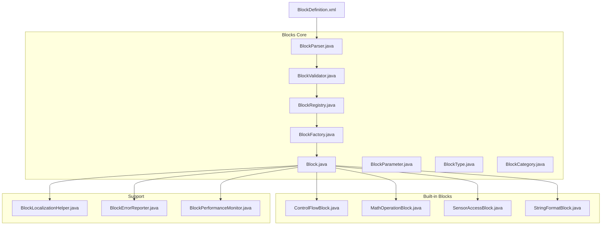
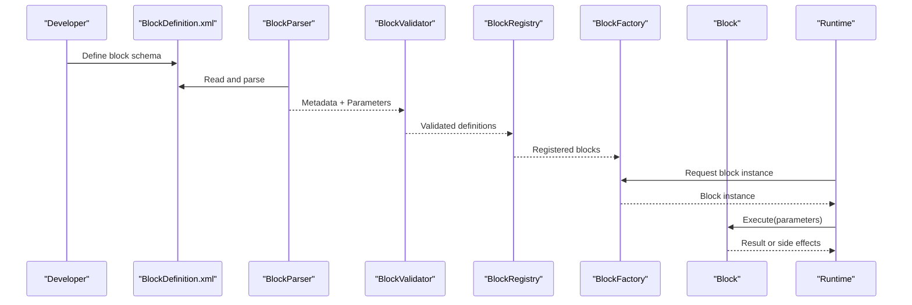
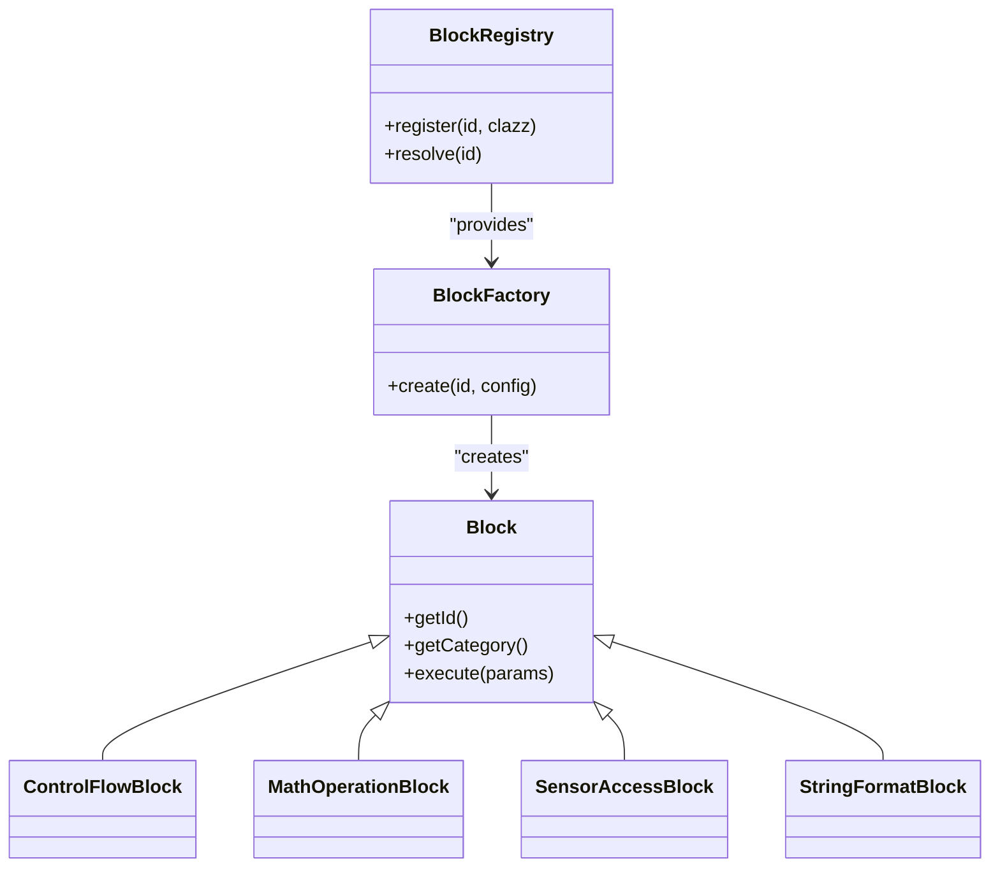
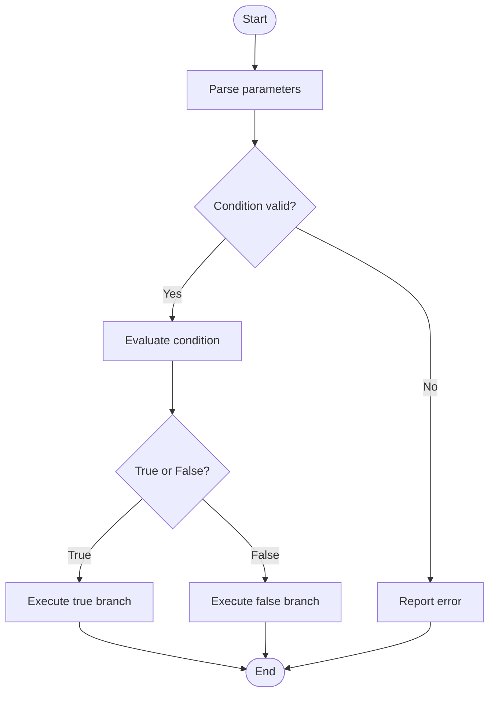
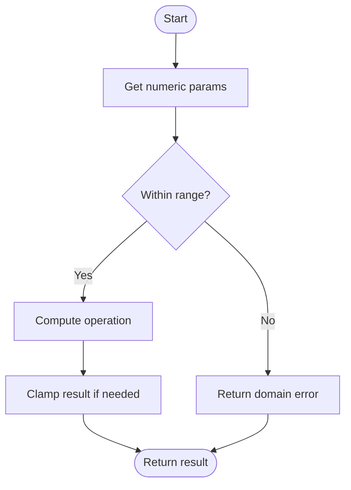
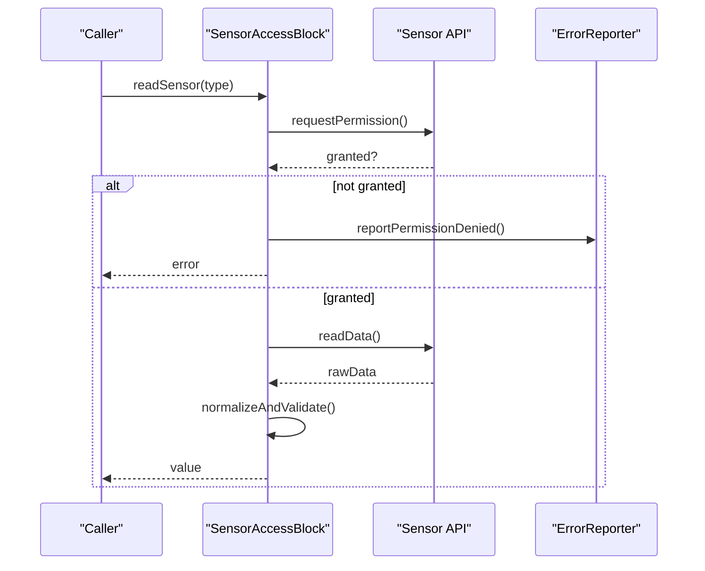
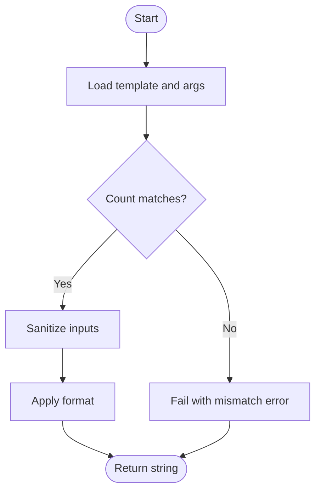
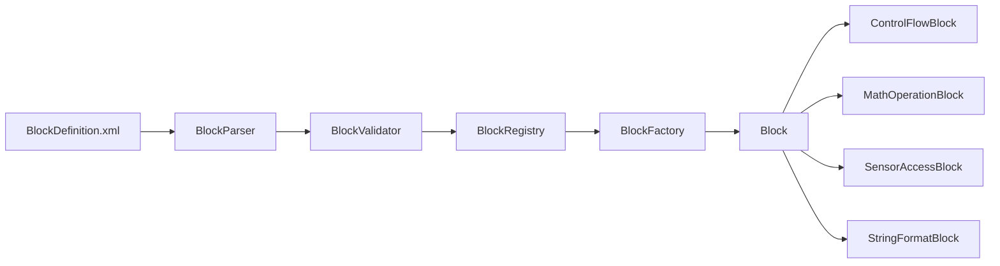

# Block Development and Creation

<cite>
**Referenced Files in This Document**
- [README.md](file://README.md)
- [catroid/src/main/assets/catblocks/BlockDefinition.xml](file://catroid/src/main/assets/catblocks/BlockDefinition.xml)
- [catroid/src/main/java/org/catrobat/catroid/blocks/Block.java](file://catroid/src/main/java/org/catrobat/catroid/blocks/Block.java)
- [catroid/src/main/java/org/catrobat/catroid/blocks/BlockParameter.java](file://catroid/src/main/java/org/catrobat/catroid/blocks/BlockParameter.java)
- [catroid/src/main/java/org/catrobat/catroid/blocks/BlockType.java](file://catroid/src/main/java/org/catrobat/catroid/blocks/BlockType.java)
- [catroid/src/main/java/org/catrobat/catroid/blocks/BlockCategory.java](file://catroid/src/main/java/org/catrobat/catroid/blocks/BlockCategory.java)
- [catroid/src/main/java/org/catrobat/catroid/blocks/BlockParser.java](file://catroid/src/main/java/org/catrobat/catroid/blocks/BlockParser.java)
- [catroid/src/main/java/org/catrobat/catroid/blocks/BlockRegistry.java](file://catroid/src/main/java/org/catrobat/catroid/blocks/BlockRegistry.java)
- [catroid/src/main/java/org/catrobat/catroid/blocks/BlockFactory.java](file://catroid/src/main/java/org/catrobat/catroid/blocks/BlockFactory.java)
- [catroid/src/main/java/org/catrobat/catroid/blocks/BlockValidator.java](file://catroid/src/main/java/org/catrobat/catroid/blocks/BlockValidator.java)
- [catroid/src/main/java/org/catrobat/catroid/blocks/ControlFlowBlock.java](file://catroid/src/main/java/org/catrobat/catroid/blocks/ControlFlowBlock.java)
- [catroid/src/main/java/org/catrobat/catroid/blocks/MathOperationBlock.java](file://catroid/src/main/java/org/catrobat/catroid/blocks/MathOperationBlock.java)
- [catroid/src/main/java/org/catrobat/catroid/blocks/SensorAccessBlock.java](file://catroid/src/main/java/org/catrobat/catroid/blocks/SensorAccessBlock.java)
- [catroid/src/main/java/org/catrobat/catroid/blocks/StringFormatBlock.java](file://catroid/src/main/java/org/catrobat/catroid/blocks/StringFormatBlock.java)
- [catroid/src/main/java/org/catrobat/catroid/blocks/BlockLocalizationHelper.java](file://catroid/src/main/java/org/catrobat/catroid/blocks/BlockLocalizationHelper.java)
- [catroid/src/main/java/org/catrobat/catroid/blocks/BlockErrorReporter.java](file://catroid/src/main/java/org/catrobat/catroid/blocks/BlockErrorReporter.java)
- [catroid/src/main/java/org/catrobat/catroid/blocks/BlockPerformanceMonitor.java](file://catroid/src/main/java/org/catrobat/catroid/blocks/BlockPerformanceMonitor.java)
</cite>

## Table of Contents
1. [Introduction](#introduction)
2. [Project Structure](#project-structure)
3. [Core Components](#core-components)
4. [Architecture Overview](#architecture-overview)
5. [Detailed Component Analysis](#detailed-component-analysis)
6. [Dependency Analysis](#dependency-analysis)
7. [Performance Considerations](#performance-considerations)
8. [Troubleshooting Guide](#troubleshooting-guide)
9. [Conclusion](#conclusion)
10. [Appendices](#appendices)

## Introduction
This document explains how to create and extend NewCatroid’s block system. It covers the XML-based block definition schema, parameter types, validation rules, registration and categorization, localization support, type safety, error handling, and practical examples for control flow, math operations, sensor access, and string formatting blocks. It also provides best practices for design, performance optimization, debugging techniques, and guidance on backward compatibility and version management for custom blocks.

## Project Structure
NewCatroid organizes block-related code under a dedicated blocks package with clear separation between definitions, parsing, validation, execution, and runtime utilities. The following diagram shows the high-level structure:

**Diagram sources**
- [catroid/src/main/java/org/catrobat/catroid/blocks/Block.java](file://catroid/src/main/java/org/catrobat/catroid/blocks/Block.java)
- [catroid/src/main/java/org/catrobat/catroid/blocks/BlockParameter.java](file://catroid/src/main/java/org/catrobat/catroid/blocks/BlockParameter.java)
- [catroid/src/main/java/org/catrobat/catroid/blocks/BlockType.java](file://catroid/src/main/java/org/catrobat/catroid/blocks/BlockType.java)
- [catroid/src/main/java/org/catrobat/catroid/blocks/BlockCategory.java](file://catroid/src/main/java/org/catrobat/catroid/blocks/BlockCategory.java)
- [catroid/src/main/java/org/catrobat/catroid/blocks/BlockParser.java](file://catroid/src/main/java/org/catrobat/catroid/blocks/BlockParser.java)
- [catroid/src/main/java/org/catrobat/catroid/blocks/BlockValidator.java](file://catroid/src/main/java/org/catrobat/catroid/blocks/BlockValidator.java)
- [catroid/src/main/java/org/catrobat/catroid/blocks/BlockRegistry.java](file://catroid/src/main/java/org/catrobat/catroid/blocks/BlockRegistry.java)
- [catroid/src/main/java/org/catrobat/catroid/blocks/BlockFactory.java](file://catroid/src/main/java/org/catrobat/catroid/blocks/BlockFactory.java)
- [catroid/src/main/java/org/catrobat/catroid/blocks/ControlFlowBlock.java](file://catroid/src/main/java/org/catrobat/catroid/blocks/ControlFlowBlock.java)
- [catroid/src/main/java/org/catrobat/catroid/blocks/MathOperationBlock.java](file://catroid/src/main/java/org/catrobat/catroid/blocks/MathOperationBlock.java)
- [catroid/src/main/java/org/catrobat/catroid/blocks/SensorAccessBlock.java](file://catroid/src/main/java/org/catrobat/catroid/blocks/SensorAccessBlock.java)
- [catroid/src/main/java/org/catrobat/catroid/blocks/StringFormatBlock.java](file://catroid/src/main/java/org/catrobat/catroid/blocks/StringFormatBlock.java)
- [catroid/src/main/java/org/catrobat/catroid/blocks/BlockLocalizationHelper.java](file://catroid/src/main/java/org/catrobat/catroid/blocks/BlockLocalizationHelper.java)
- [catroid/src/main/java/org/catrobat/catroid/blocks/BlockErrorReporter.java](file://catroid/src/main/java/org/catrobat/catroid/blocks/BlockErrorReporter.java)
- [catroid/src/main/java/org/catrobat/catroid/blocks/BlockPerformanceMonitor.java](file://catroid/src/main/java/org/catrobat/catroid/blocks/BlockPerformanceMonitor.java)
- [catroid/src/main/assets/catblocks/BlockDefinition.xml](file://catroid/src/main/assets/catblocks/BlockDefinition.xml)

**Section sources**
- [README.md](file://README.md)

## Core Components
- Block: Base class defining common properties (name, category, parameters), lifecycle hooks, and execution entry points.
- BlockParameter: Represents typed inputs (numbers, strings, booleans, lists, sprites, etc.) with constraints and default values.
- BlockType: Enumerates supported parameter types and return types used by the parser and validator.
- BlockCategory: Groups blocks into logical categories (e.g., Motion, Looks, Control, Sensing).
- BlockParser: Reads XML definitions and constructs Block metadata and parameters.
- BlockValidator: Enforces schema rules, type consistency, and cross-field constraints.
- BlockRegistry: Central registry that maps block identifiers to implementations and supports discovery.
- BlockFactory: Instantiates blocks from parsed definitions and injects dependencies.
- Built-in Blocks: Concrete implementations demonstrating patterns for control flow, math, sensors, and string formatting.
- Support Utilities: Localization helper, error reporter, and performance monitor.

Key responsibilities:
- Definition-driven configuration via XML
- Strong typing and validation at parse time
- Runtime instantiation and execution through factory and registry
- Localized labels and descriptions
- Error reporting and diagnostics
- Performance monitoring for hot paths

**Section sources**
- [catroid/src/main/java/org/catrobat/catroid/blocks/Block.java](file://catroid/src/main/java/org/catrobat/catroid/blocks/Block.java)
- [catroid/src/main/java/org/catrobat/catroid/blocks/BlockParameter.java](file://catroid/src/main/java/org/catrobat/catroid/blocks/BlockParameter.java)
- [catroid/src/main/java/org/catrobat/catroid/blocks/BlockType.java](file://catroid/src/main/java/org/catrobat/catroid/blocks/BlockType.java)
- [catroid/src/main/java/org/catrobat/catroid/blocks/BlockCategory.java](file://catroid/src/main/java/org/catrobat/catroid/blocks/BlockCategory.java)
- [catroid/src/main/java/org/catrobat/catroid/blocks/BlockParser.java](file://catroid/src/main/java/org/catrobat/catroid/blocks/BlockParser.java)
- [catroid/src/main/java/org/catrobat/catroid/blocks/BlockValidator.java](file://catroid/src/main/java/org/catrobat/catroid/blocks/BlockValidator.java)
- [catroid/src/main/java/org/catrobat/catroid/blocks/BlockRegistry.java](file://catroid/src/main/java/org/catrobat/catroid/blocks/BlockRegistry.java)
- [catroid/src/main/java/org/catrobat/catroid/blocks/BlockFactory.java](file://catroid/src/main/java/org/catrobat/catroid/blocks/BlockFactory.java)

## Architecture Overview
The block system follows a declarative-first approach:
- XML defines block metadata and parameters
- Parser builds structured representations
- Validator enforces correctness
- Registry stores available blocks
- Factory creates instances at runtime
- Execution invokes typed parameters and returns results

**Diagram sources**
- [catroid/src/main/assets/catblocks/BlockDefinition.xml](file://catroid/src/main/assets/catblocks/BlockDefinition.xml)
- [catroid/src/main/java/org/catrobat/catroid/blocks/BlockParser.java](file://catroid/src/main/java/org/catrobat/catroid/blocks/BlockParser.java)
- [catroid/src/main/java/org/catrobat/catroid/blocks/BlockValidator.java](file://catroid/src/main/java/org/catrobat/catroid/blocks/BlockValidator.java)
- [catroid/src/main/java/org/catrobat/catroid/blocks/BlockRegistry.java](file://catroid/src/main/java/org/catrobat/catroid/blocks/BlockRegistry.java)
- [catroid/src/main/java/org/catrobat/catroid/blocks/BlockFactory.java](file://catroid/src/main/java/org/catrobat/catroid/blocks/BlockFactory.java)
- [catroid/src/main/java/org/catrobat/catroid/blocks/Block.java](file://catroid/src/main/java/org/catrobat/catroid/blocks/Block.java)

## Detailed Component Analysis

### XML-Based Block Definition Schema
The XML file declares blocks, their categories, labels, and parameters. Key elements include:
- Block identifier and human-readable label
- Category assignment
- Parameter list with type, name, default value, and optional constraints
- Optional documentation and localization keys

Validation rules enforced by the validator:
- Unique identifiers per category
- Required fields present
- Type compatibility between declared and expected types
- Default values match parameter types
- No circular references or invalid combinations

Best practices:
- Use descriptive IDs and labels
- Provide defaults for numeric/string parameters
- Group related blocks under consistent categories
- Keep parameter count minimal for usability

**Section sources**
- [catroid/src/main/assets/catblocks/BlockDefinition.xml](file://catroid/src/main/assets/catblocks/BlockDefinition.xml)
- [catroid/src/main/java/org/catrobat/catroid/blocks/BlockParser.java](file://catroid/src/main/java/org/catrobat/catroid/blocks/BlockParser.java)
- [catroid/src/main/java/org/catrobat/catroid/blocks/BlockValidator.java](file://catroid/src/main/java/org/catrobat/catroid/blocks/BlockValidator.java)

### Block Class and Lifecycle
The base Block class encapsulates:
- Identification and metadata
- Typed parameter accessors
- Execution hook(s) where logic is implemented
- Integration with localization and error reporting

Lifecycle highlights:
- Construction via factory with injected dependencies
- Initialization phase for setup
- Execution phase for performing work
- Cleanup if needed

Design tips:
- Keep execution fast; offload heavy work to background threads when appropriate
- Avoid blocking UI thread
- Use typed parameters to prevent runtime casting errors

**Section sources**
- [catroid/src/main/java/org/catrobat/catroid/blocks/Block.java](file://catroid/src/main/java/org/catrobat/catroid/blocks/Block.java)

### Parameter Types and Validation
Supported parameter types include numbers, strings, booleans, lists, sprites, and more. Each parameter can specify:
- Type
- Name and display label
- Default value
- Constraints (min/max, regex, allowed values)

Validation occurs during parsing and again before execution to ensure correctness. Errors are reported via the error reporter utility.

**Section sources**
- [catroid/src/main/java/org/catrobat/catroid/blocks/BlockParameter.java](file://catroid/src/main/java/org/catrobat/catroid/blocks/BlockParameter.java)
- [catroid/src/main/java/org/catrobat/catroid/blocks/BlockType.java](file://catroid/src/main/java/org/catrobat/catroid/blocks/BlockType.java)
- [catroid/src/main/java/org/catrobat/catroid/blocks/BlockValidator.java](file://catroid/src/main/java/org/catrobat/catroid/blocks/BlockValidator.java)
- [catroid/src/main/java/org/catrobat/catroid/blocks/BlockErrorReporter.java](file://catroid/src/main/java/org/catrobat/catroid/blocks/BlockErrorReporter.java)

### Registration and Factory
Registration centralizes block availability:
- Registry maintains mappings from identifiers to classes
- Supports dynamic discovery and updates
- Provides lookup APIs for the editor and runtime

Factory handles instantiation:
- Resolves dependencies
- Applies configuration
- Returns ready-to-execute instances

**Diagram sources**
- [catroid/src/main/java/org/catrobat/catroid/blocks/Block.java](file://catroid/src/main/java/org/catrobat/catroid/blocks/Block.java)
- [catroid/src/main/java/org/catrobat/catroid/blocks/BlockRegistry.java](file://catroid/src/main/java/org/catrobat/catroid/blocks/BlockRegistry.java)
- [catroid/src/main/java/org/catrobat/catroid/blocks/BlockFactory.java](file://catroid/src/main/java/org/catrobat/catroid/blocks/BlockFactory.java)
- [catroid/src/main/java/org/catrobat/catroid/blocks/ControlFlowBlock.java](file://catroid/src/main/java/org/catrobat/catroid/blocks/ControlFlowBlock.java)
- [catroid/src/main/java/org/catrobat/catroid/blocks/MathOperationBlock.java](file://catroid/src/main/java/org/catrobat/catroid/blocks/MathOperationBlock.java)
- [catroid/src/main/java/org/catrobat/catroid/blocks/SensorAccessBlock.java](file://catroid/src/main/java/org/catrobat/catroid/blocks/SensorAccessBlock.java)
- [catroid/src/main/java/org/catrobat/catroid/blocks/StringFormatBlock.java](file://catroid/src/main/java/org/catrobat/catroid/blocks/StringFormatBlock.java)

**Section sources**
- [catroid/src/main/java/org/catrobat/catroid/blocks/BlockRegistry.java](file://catroid/src/main/java/org/catrobat/catroid/blocks/BlockRegistry.java)
- [catroid/src/main/java/org/catrobat/catroid/blocks/BlockFactory.java](file://catroid/src/main/java/org/catrobat/catroid/blocks/BlockFactory.java)

### Localization Support
Blocks use localized labels and descriptions:
- Keys defined in XML map to resource bundles
- Helper resolves current locale and returns user-facing text
- Editor displays localized names and tooltips

Guidelines:
- Always externalize user-visible strings
- Provide fallbacks for missing translations
- Test across locales to avoid layout issues

**Section sources**
- [catroid/src/main/java/org/catrobat/catroid/blocks/BlockLocalizationHelper.java](file://catroid/src/main/java/org/catrobat/catroid/blocks/BlockLocalizationHelper.java)

### Practical Examples

#### Control Flow Block
Purpose: Implement conditional or looping behavior using typed parameters.
- Define parameters for condition expression and action blocks
- Validate boolean input
- Execute branch based on runtime evaluation

**Diagram sources**
- [catroid/src/main/java/org/catrobat/catroid/blocks/ControlFlowBlock.java](file://catroid/src/main/java/org/catrobat/catroid/blocks/ControlFlowBlock.java)
- [catroid/src/main/java/org/catrobat/catroid/blocks/BlockValidator.java](file://catroid/src/main/java/org/catrobat/catroid/blocks/BlockValidator.java)
- [catroid/src/main/java/org/catrobat/catroid/blocks/BlockErrorReporter.java](file://catroid/src/main/java/org/catrobat/catroid/blocks/BlockErrorReporter.java)

**Section sources**
- [catroid/src/main/java/org/catrobat/catroid/blocks/ControlFlowBlock.java](file://catroid/src/main/java/org/catrobat/catroid/blocks/ControlFlowBlock.java)

#### Math Operation Block
Purpose: Perform arithmetic or mathematical functions with validated numeric inputs.
- Accept numeric parameters with min/max constraints
- Compute result safely, handling edge cases (division by zero, overflow)
- Return typed output

**Diagram sources**
- [catroid/src/main/java/org/catrobat/catroid/blocks/MathOperationBlock.java](file://catroid/src/main/java/org/catrobat/catroid/blocks/MathOperationBlock.java)
- [catroid/src/main/java/org/catrobat/catroid/blocks/BlockValidator.java](file://catroid/src/main/java/org/catrobat/catroid/blocks/BlockValidator.java)

**Section sources**
- [catroid/src/main/java/org/catrobat/catroid/blocks/MathOperationBlock.java](file://catroid/src/main/java/org/catrobat/catroid/blocks/MathOperationBlock.java)

#### Sensor Access Block
Purpose: Read device or environment sensors and expose values as typed parameters.
- Request permission if required
- Read sensor data asynchronously
- Convert raw data to safe, normalized values
- Handle unavailable or noisy sensors gracefully

**Diagram sources**
- [catroid/src/main/java/org/catrobat/catroid/blocks/SensorAccessBlock.java](file://catroid/src/main/java/org/catrobat/catroid/blocks/SensorAccessBlock.java)
- [catroid/src/main/java/org/catrobat/catroid/blocks/BlockErrorReporter.java](file://catroid/src/main/java/org/catrobat/catroid/blocks/BlockErrorReporter.java)

**Section sources**
- [catroid/src/main/java/org/catrobat/catroid/blocks/SensorAccessBlock.java](file://catroid/src/main/java/org/catrobat/catroid/blocks/SensorAccessBlock.java)

#### String Formatting Block
Purpose: Build formatted strings using placeholders and typed arguments.
- Validate placeholder count matches arguments
- Sanitize inputs to prevent injection
- Produce final string safely

**Diagram sources**
- [catroid/src/main/java/org/catrobat/catroid/blocks/StringFormatBlock.java](file://catroid/src/main/java/org/catrobat/catroid/blocks/StringFormatBlock.java)
- [catroid/src/main/java/org/catrobat/catroid/blocks/BlockValidator.java](file://catroid/src/main/java/org/catrobat/catroid/blocks/BlockValidator.java)

**Section sources**
- [catroid/src/main/java/org/catrobat/catroid/blocks/StringFormatBlock.java](file://catroid/src/main/java/org/catrobat/catroid/blocks/StringFormatBlock.java)

### Backward Compatibility and Version Management
Guidelines:
- Assign semantic versions to block definitions
- Maintain migration scripts for schema changes
- Preserve deprecated fields with warnings
- Ensure older projects load with graceful degradation
- Use registry version checks to enable/disable incompatible blocks

Implementation hints:
- Store version metadata alongside block definitions
- On load, compare project vs. runtime versions
- Apply transformations to outdated definitions
- Log deprecations and provide upgrade paths

**Section sources**
- [catroid/src/main/java/org/catrobat/catroid/blocks/BlockRegistry.java](file://catroid/src/main/java/org/catrobat/catroid/blocks/BlockRegistry.java)
- [catroid/src/main/java/org/catrobat/catroid/blocks/BlockParser.java](file://catroid/src/main/java/org/catrobat/catroid/blocks/BlockParser.java)

## Dependency Analysis
The block system exhibits low coupling and high cohesion:
- XML is decoupled from implementation via parser
- Validator isolates rule enforcement
- Registry abstracts discovery and mapping
- Factory encapsulates instantiation details
- Built-in blocks depend only on core abstractions

**Diagram sources**
- [catroid/src/main/assets/catblocks/BlockDefinition.xml](file://catroid/src/main/assets/catblocks/BlockDefinition.xml)
- [catroid/src/main/java/org/catrobat/catroid/blocks/BlockParser.java](file://catroid/src/main/java/org/catrobat/catroid/blocks/BlockParser.java)
- [catroid/src/main/java/org/catrobat/catroid/blocks/BlockValidator.java](file://catroid/src/main/java/org/catrobat/catroid/blocks/BlockValidator.java)
- [catroid/src/main/java/org/catrobat/catroid/blocks/BlockRegistry.java](file://catroid/src/main/java/org/catrobat/catroid/blocks/BlockRegistry.java)
- [catroid/src/main/java/org/catrobat/catroid/blocks/BlockFactory.java](file://catroid/src/main/java/org/catrobat/catroid/blocks/BlockFactory.java)
- [catroid/src/main/java/org/catrobat/catroid/blocks/Block.java](file://catroid/src/main/java/org/catrobat/catroid/blocks/Block.java)
- [catroid/src/main/java/org/catrobat/catroid/blocks/ControlFlowBlock.java](file://catroid/src/main/java/org/catrobat/catroid/blocks/ControlFlowBlock.java)
- [catroid/src/main/java/org/catrobat/catroid/blocks/MathOperationBlock.java](file://catroid/src/main/java/org/catrobat/catroid/blocks/MathOperationBlock.java)
- [catroid/src/main/java/org/catrobat/catroid/blocks/SensorAccessBlock.java](file://catroid/src/main/java/org/catrobat/catroid/blocks/SensorAccessBlock.java)
- [catroid/src/main/java/org/catrobat/catroid/blocks/StringFormatBlock.java](file://catroid/src/main/java/org/catrobat/catroid/blocks/StringFormatBlock.java)

**Section sources**
- [catroid/src/main/java/org/catrobat/catroid/blocks/BlockParser.java](file://catroid/src/main/java/org/catrobat/catroid/blocks/BlockParser.java)
- [catroid/src/main/java/org/catrobat/catroid/blocks/BlockValidator.java](file://catroid/src/main/java/org/catrobat/catroid/blocks/BlockValidator.java)
- [catroid/src/main/java/org/catrobat/catroid/blocks/BlockRegistry.java](file://catroid/src/main/java/org/catrobat/catroid/blocks/BlockRegistry.java)
- [catroid/src/main/java/org/catrobat/catroid/blocks/BlockFactory.java](file://catroid/src/main/java/org/catrobat/catroid/blocks/BlockFactory.java)

## Performance Considerations
- Minimize allocations inside hot loops; reuse buffers when possible
- Avoid synchronous I/O in block execution; prefer async APIs
- Cache expensive computations and lookups within block scope
- Use typed parameters to reduce runtime casts and checks
- Monitor execution time with performance monitor and profile bottlenecks
- Debounce frequent sensor reads to reduce overhead

[No sources needed since this section provides general guidance]

## Troubleshooting Guide
Common issues and strategies:
- Parsing failures: Inspect XML schema compliance and field presence
- Validation errors: Review parameter types, defaults, and constraints
- Runtime exceptions: Use error reporter to capture context and stack traces
- Localization problems: Verify key existence and fallback behavior
- Performance regressions: Enable performance monitor and analyze hotspots

Debugging steps:
- Enable detailed logs during development
- Isolate failing blocks by disabling others
- Reproduce with minimal XML definitions
- Validate inputs explicitly and log intermediate states

**Section sources**
- [catroid/src/main/java/org/catrobat/catroid/blocks/BlockErrorReporter.java](file://catroid/src/main/java/org/catrobat/catroid/blocks/BlockErrorReporter.java)
- [catroid/src/main/java/org/catrobat/catroid/blocks/BlockPerformanceMonitor.java](file://catroid/src/main/java/org/catrobat/catroid/blocks/BlockPerformanceMonitor.java)

## Conclusion
NewCatroid’s block system combines declarative XML definitions with strong typing, robust validation, and a clean runtime architecture. By following the guidelines here—defining clear schemas, implementing efficient execution logic, leveraging localization and error reporting, and planning for backward compatibility—you can create reliable, user-friendly blocks that integrate seamlessly into the editor and runtime.

[No sources needed since this section summarizes without analyzing specific files]

## Appendices

### Best Practices Checklist
- Keep blocks focused and small
- Prefer immutable inputs and outputs
- Provide meaningful defaults and constraints
- Externalize all user-facing text
- Add comprehensive tests for edge cases
- Profile critical blocks regularly
- Document breaking changes and migration steps

[No sources needed since this section provides general guidance]