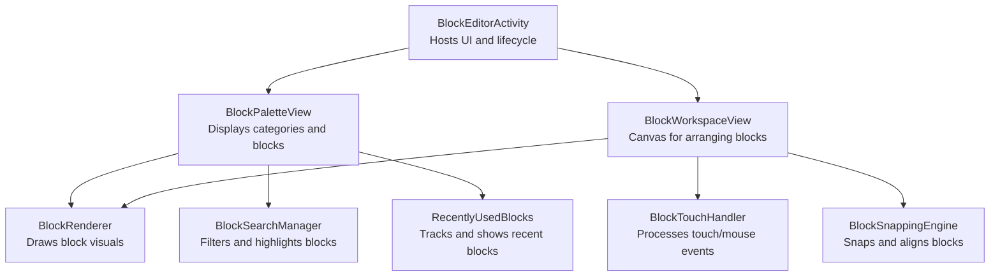
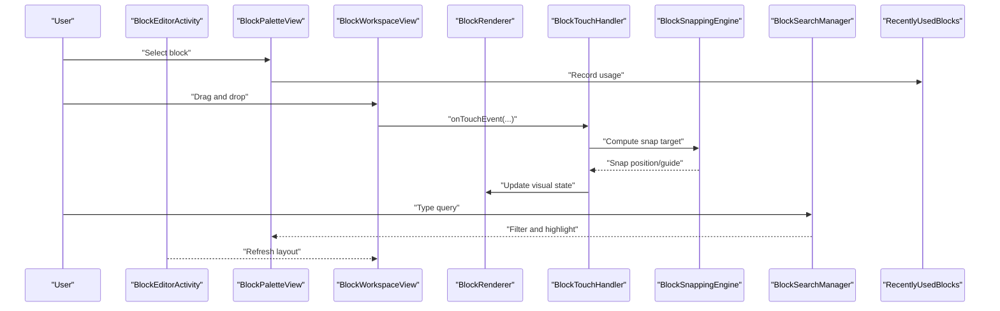
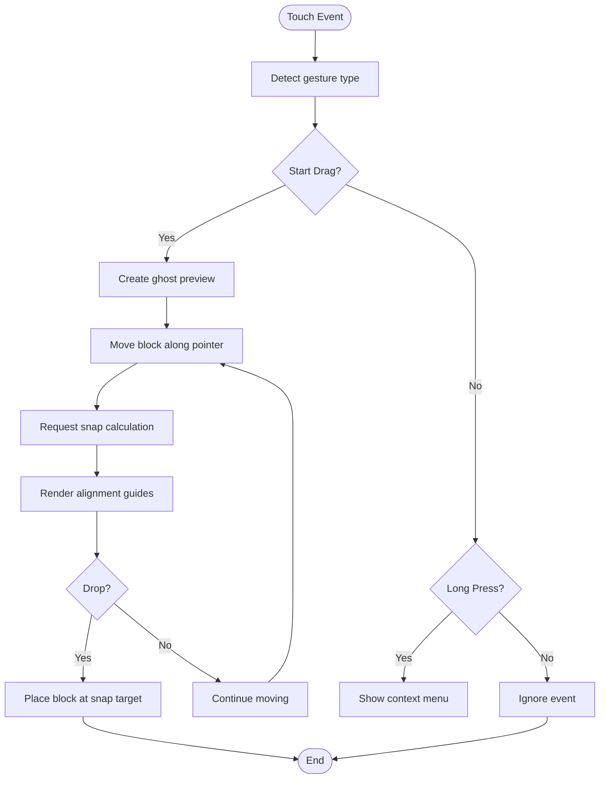
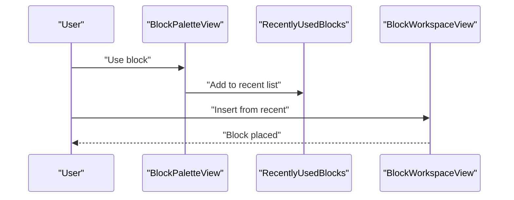
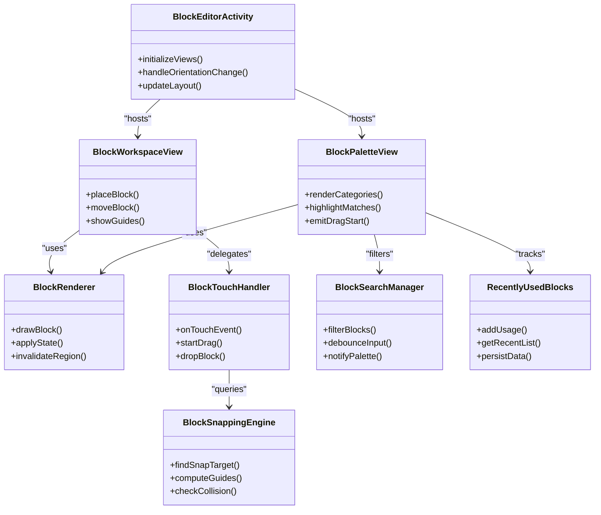

# Block Editor Interface

<cite>
**Referenced Files in This Document**
- [README.md](file://README.md)
- [catroid/src/main/java/org/catrobat/catroid/ui/blockeditor/BlockEditorActivity.java](file://catroid/src/main/java/org/catrobat/catroid/ui/blockeditor/BlockEditorActivity.java)
- [catroid/src/main/java/org/catrobat/catroid/ui/blockeditor/BlockPaletteView.java](file://catroid/src/main/java/org/catrobat/catroid/ui/blockeditor/BlockPaletteView.java)
- [catroid/src/main/java/org/catrobat/catroid/ui/blockeditor/BlockWorkspaceView.java](file://catroid/src/main/java/org/catrobat/catroid/ui/blockeditor/BlockWorkspaceView.java)
- [catroid/src/main/java/org/catrobat/catroid/ui/blockeditor/BlockRenderer.java](file://catroid/src/main/java/org/catrobat/catroid/ui/blockeditor/BlockRenderer.java)
- [catroid/src/main/java/org/catrobat/catroid/ui/blockeditor/BlockTouchHandler.java](file://catroid/src/main/java/org/catrobat/catroid/ui/blockeditor/BlockTouchHandler.java)
- [catroid/src/main/java/org/catrobat/catroid/ui/blockeditor/BlockSnappingEngine.java](file://catroid/src/main/java/org/catrobat/catroid/ui/blockeditor/BlockSnappingEngine.java)
- [catroid/src/main/java/org/catrobat/catroid/ui/blockeditor/BlockSearchManager.java](file://catroid/src/main/java/org/catrobat/catroid/ui/blockeditor/BlockSearchManager.java)
- [catroid/src/main/java/org/catrobat/catroid/ui/blockeditor/RecentlyUsedBlocks.java](file://catroid/src/main/java/org/catrobat/catroid/ui/blockeditor/RecentlyUsedBlocks.java)
- [catroid/src/main/res/layout/activity_block_editor.xml](file://catroid/src/main/res/layout/activity_block_editor.xml)
- [catroid/src/main/res/values/strings.xml](file://catroid/src/main/res/values/strings.xml)
- [catroid/src/main/res/values/styles.xml](file://catroid/src/main/res/values/styles.xml)
</cite>

## Table of Contents
1. [Introduction](#introduction)
2. [Project Structure](#project-structure)
3. [Core Components](#core-components)
4. [Architecture Overview](#architecture-overview)
5. [Detailed Component Analysis](#detailed-component-analysis)
6. [Dependency Analysis](#dependency-analysis)
7. [Performance Considerations](#performance-considerations)
8. [Troubleshooting Guide](#troubleshooting-guide)
9. [Conclusion](#conclusion)
10. [Appendices](#appendices)

## Introduction
This document explains the NewCatroid block editor interface, focusing on the visual drag-and-drop programming environment. It covers how users interact with blocks, navigate the block palette, and arrange blocks in the workspace. It also documents UI components that render blocks, handle touch/mouse events, provide visual feedback during manipulation, and details features such as block categories, search, recently used blocks, snapping, alignment guides, collision detection, responsive design, keyboard shortcuts, accessibility, internationalization, and customization examples.

## Project Structure
The block editor is implemented within the Android application module under catroid. The primary entry point for the editor is an Activity that hosts a palette view and a workspace view. Rendering, input handling, snapping, search, and recent usage are encapsulated into focused classes to keep responsibilities clear and maintainable.

**Diagram sources**
- [catroid/src/main/java/org/catrobat/catroid/ui/blockeditor/BlockEditorActivity.java](file://catroid/src/main/java/org/catrobat/catroid/ui/blockeditor/BlockEditorActivity.java)
- [catroid/src/main/java/org/catrobat/catroid/ui/blockeditor/BlockPaletteView.java](file://catroid/src/main/java/org/catrobat/catroid/ui/blockeditor/BlockPaletteView.java)
- [catroid/src/main/java/org/catrobat/catroid/ui/blockeditor/BlockWorkspaceView.java](file://catroid/src/main/java/org/catrobat/catroid/ui/blockeditor/BlockWorkspaceView.java)
- [catroid/src/main/java/org/catrobat/catroid/ui/blockeditor/BlockRenderer.java](file://catroid/src/main/java/org/catrobat/catroid/ui/blockeditor/BlockRenderer.java)
- [catroid/src/main/java/org/catrobat/catroid/ui/blockeditor/BlockTouchHandler.java](file://catroid/src/main/java/org/catrobat/catroid/ui/blockeditor/BlockTouchHandler.java)
- [catroid/src/main/java/org/catrobat/catroid/ui/blockeditor/BlockSnappingEngine.java](file://catroid/src/main/java/org/catrobat/catroid/ui/blockeditor/BlockSnappingEngine.java)
- [catroid/src/main/java/org/catrobat/catroid/ui/blockeditor/BlockSearchManager.java](file://catroid/src/main/java/org/catrobat/catroid/ui/blockeditor/BlockSearchManager.java)
- [catroid/src/main/java/org/catrobat/catroid/ui/blockeditor/RecentlyUsedBlocks.java](file://catroid/src/main/java/org/catrobat/catroid/ui/blockeditor/RecentlyUsedBlocks.java)

**Section sources**
- [README.md](file://README.md)

## Core Components
- BlockEditorActivity: Orchestrates the editor UI, manages layout transitions between palette and workspace, and coordinates user actions.
- BlockPaletteView: Renders the list of block categories and individual blocks; supports scrolling, selection, and search highlighting.
- BlockWorkspaceView: Provides a scrollable canvas where blocks can be placed, moved, grouped, and connected.
- BlockRenderer: Encapsulates drawing logic for block shapes, labels, inputs, and visual states (selected, highlighted, ghost).
- BlockTouchHandler: Translates raw touch/mouse events into semantic actions like start-drag, move, drop, and long-press context operations.
- BlockSnappingEngine: Computes snap targets, alignment guides, and collision constraints to ensure blocks connect correctly.
- BlockSearchManager: Filters blocks by text, updates category visibility, and highlights matching items in the palette.
- RecentlyUsedBlocks: Maintains a history of recently used blocks and surfaces them for quick access.

Key responsibilities and interactions:
- Palette-to-workspace transfer: User drags a block from the palette; the system creates a workspace instance and places it at the drop location.
- Workspace manipulation: Users move, rotate, group, and connect blocks; snapping and collision detection guide placement.
- Search and filtering: Typing in the search field narrows visible blocks and categories; matches are visually emphasized.
- Recent usage: Blocks used recently appear in a dedicated section or suggestion area to speed up workflow.

**Section sources**
- [catroid/src/main/java/org/catrobat/catroid/ui/blockeditor/BlockEditorActivity.java](file://catroid/src/main/java/org/catrobat/catroid/ui/blockeditor/BlockEditorActivity.java)
- [catroid/src/main/java/org/catrobat/catroid/ui/blockeditor/BlockPaletteView.java](file://catroid/src/main/java/org/catrobat/catroid/ui/blockeditor/BlockPaletteView.java)
- [catroid/src/main/java/org/catrobat/catroid/ui/blockeditor/BlockWorkspaceView.java](file://catroid/src/main/java/org/catrobat/catroid/ui/blockeditor/BlockWorkspaceView.java)
- [catroid/src/main/java/org/catrobat/catroid/ui/blockeditor/BlockRenderer.java](file://catroid/src/main/java/org/catrobat/catroid/ui/blockeditor/BlockRenderer.java)
- [catroid/src/main/java/org/catrobat/catroid/ui/blockeditor/BlockTouchHandler.java](file://catroid/src/main/java/org/catrobat/catroid/ui/blockeditor/BlockTouchHandler.java)
- [catroid/src/main/java/org/catrobat/catroid/ui/blockeditor/BlockSnappingEngine.java](file://catroid/src/main/java/org/catrobat/catroid/ui/blockeditor/BlockSnappingEngine.java)
- [catroid/src/main/java/org/catrobat/catroid/ui/blockeditor/BlockSearchManager.java](file://catroid/src/main/java/org/catrobat/catroid/ui/blockeditor/BlockSearchManager.java)
- [catroid/src/main/java/org/catrobat/catroid/ui/blockeditor/RecentlyUsedBlocks.java](file://catroid/src/main/java/org/catrobat/catroid/ui/blockeditor/RecentlyUsedBlocks.java)

## Architecture Overview
The editor follows a layered architecture:
- Presentation layer: Views (palette and workspace) and renderer.
- Interaction layer: Touch handler translates gestures into commands.
- Logic layer: Snapping engine enforces rules; search manager filters content; recent usage tracks patterns.
- Host layer: Activity manages lifecycle and composes views.

**Diagram sources**
- [catroid/src/main/java/org/catrobat/catroid/ui/blockeditor/BlockEditorActivity.java](file://catroid/src/main/java/org/catrobat/catroid/ui/blockeditor/BlockEditorActivity.java)
- [catroid/src/main/java/org/catrobat/catroid/ui/blockeditor/BlockPaletteView.java](file://catroid/src/main/java/org/catrobat/catroid/ui/blockeditor/BlockPaletteView.java)
- [catroid/src/main/java/org/catrobat/catroid/ui/blockeditor/BlockWorkspaceView.java](file://catroid/src/main/java/org/catrobat/catroid/ui/blockeditor/BlockWorkspaceView.java)
- [catroid/src/main/java/org/catrobat/catroid/ui/blockeditor/BlockRenderer.java](file://catroid/src/main/java/org/catrobat/catroid/ui/blockeditor/BlockRenderer.java)
- [catroid/src/main/java/org/catrobat/catroid/ui/blockeditor/BlockTouchHandler.java](file://catroid/src/main/java/org/catrobat/catroid/ui/blockeditor/BlockTouchHandler.java)
- [catroid/src/main/java/org/catrobat/catroid/ui/blockeditor/BlockSnappingEngine.java](file://catroid/src/main/java/org/catrobat/catroid/ui/blockeditor/BlockSnappingEngine.java)
- [catroid/src/main/java/org/catrobat/catroid/ui/blockeditor/BlockSearchManager.java](file://catroid/src/main/java/org/catrobat/catroid/ui/blockeditor/BlockSearchManager.java)
- [catroid/src/main/java/org/catrobat/catroid/ui/blockeditor/RecentlyUsedBlocks.java](file://catroid/src/main/java/org/catrobat/catroid/ui/blockeditor/RecentlyUsedBlocks.java)

## Detailed Component Analysis

### BlockEditorActivity
Responsibilities:
- Inflates the editor layout and binds palette/workspace views.
- Manages orientation changes and screen size adaptations.
- Delegates editing actions to specialized handlers.

Interaction points:
- Initializes search input and recent usage tracking.
- Coordinates rendering updates when blocks change.

**Section sources**
- [catroid/src/main/java/org/catrobat/catroid/ui/blockeditor/BlockEditorActivity.java](file://catroid/src/main/java/org/catrobat/catroid/ui/blockeditor/BlockEditorActivity.java)
- [catroid/src/main/res/layout/activity_block_editor.xml](file://catroid/src/main/res/layout/activity_block_editor.xml)

### BlockPaletteView
Responsibilities:
- Displays categorized blocks and supports scrolling.
- Highlights search matches and toggles category visibility.
- Emits drag-start events for selected blocks.

Features:
- Category navigation via tabs or sections.
- Visual feedback for hover/selection states.

**Section sources**
- [catroid/src/main/java/org/catrobat/catroid/ui/blockeditor/BlockPaletteView.java](file://catroid/src/main/java/org/catrobat/catroid/ui/blockeditor/BlockPaletteView.java)
- [catroid/src/main/java/org/catrobat/catroid/ui/blockeditor/BlockSearchManager.java](file://catroid/src/main/java/org/catrobat/catroid/ui/blockeditor/BlockSearchManager.java)

### BlockWorkspaceView
Responsibilities:
- Acts as a scrollable canvas for blocks.
- Handles block placement, movement, grouping, and connection.
- Integrates snapping and collision detection.

Behavior:
- Renders ghost previews during drag.
- Shows alignment guides while positioning.

**Section sources**
- [catroid/src/main/java/org/catrobat/catroid/ui/blockeditor/BlockWorkspaceView.java](file://catroid/src/main/java/org/catrobat/catroid/ui/blockeditor/BlockWorkspaceView.java)
- [catroid/src/main/java/org/catrobat/catroid/ui/blockeditor/BlockSnappingEngine.java](file://catroid/src/main/java/org/catrobat/catroid/ui/blockeditor/BlockSnappingEngine.java)

### BlockRenderer
Responsibilities:
- Draws block shapes, borders, labels, and input fields.
- Applies visual states: normal, selected, highlighted, ghost.
- Optimizes redraw regions to minimize overhead.

Customization:
- Theme-aware colors and fonts.
- Configurable padding and corner radius.

**Section sources**
- [catroid/src/main/java/org/catrobat/catroid/ui/blockeditor/BlockRenderer.java](file://catroid/src/main/java/org/catrobat/catroid/ui/blockeditor/BlockRenderer.java)
- [catroid/src/main/res/values/styles.xml](file://catroid/src/main/res/values/styles.xml)

### BlockTouchHandler
Responsibilities:
- Interprets touch/mouse events for dragging, moving, dropping, and long-press actions.
- Updates block positions and triggers snapping checks.
- Provides haptic and visual feedback during interactions.

Flow:

**Diagram sources**
- [catroid/src/main/java/org/catrobat/catroid/ui/blockeditor/BlockTouchHandler.java](file://catroid/src/main/java/org/catrobat/catroid/ui/blockeditor/BlockTouchHandler.java)
- [catroid/src/main/java/org/catrobat/catroid/ui/blockeditor/BlockSnappingEngine.java](file://catroid/src/main/java/org/catrobat/catroid/ui/blockeditor/BlockSnappingEngine.java)

**Section sources**
- [catroid/src/main/java/org/catrobat/catroid/ui/blockeditor/BlockTouchHandler.java](file://catroid/src/main/java/org/catrobat/catroid/ui/blockeditor/BlockTouchHandler.java)

### BlockSnappingEngine
Responsibilities:
- Determines valid snap targets based on block types and connections.
- Computes alignment guides for precise placement.
- Enforces collision constraints to prevent overlaps.

Algorithm overview:
- Candidate selection: Identify nearby blocks with compatible ports.
- Distance scoring: Prefer closer and more semantically appropriate targets.
- Guide generation: Draw horizontal/vertical lines indicating alignment.

**Section sources**
- [catroid/src/main/java/org/catrobat/catroid/ui/blockeditor/BlockSnappingEngine.java](file://catroid/src/main/java/org/catrobat/catroid/ui/blockeditor/BlockSnappingEngine.java)

### BlockSearchManager
Responsibilities:
- Filters blocks by keywords across names and descriptions.
- Updates category visibility and highlights matching items.
- Debounces input to reduce reflows.

Integration:
- Listens to text changes in the search field.
- Notifies palette view to refresh display.

**Section sources**
- [catroid/src/main/java/org/catrobat/catroid/ui/blockeditor/BlockSearchManager.java](file://catroid/src/main/java/org/catrobat/catroid/ui/blockeditor/BlockSearchManager.java)

### RecentlyUsedBlocks
Responsibilities:
- Tracks blocks used most recently.
- Exposes a curated list for quick insertion.
- Persists usage data across sessions.

Usage flow:

**Diagram sources**
- [catroid/src/main/java/org/catrobat/catroid/ui/blockeditor/RecentlyUsedBlocks.java](file://catroid/src/main/java/org/catrobat/catroid/ui/blockeditor/RecentlyUsedBlocks.java)
- [catroid/src/main/java/org/catrobat/catroid/ui/blockeditor/BlockPaletteView.java](file://catroid/src/main/java/org/catrobat/catroid/ui/blockeditor/BlockPaletteView.java)
- [catroid/src/main/java/org/catrobat/catroid/ui/blockeditor/BlockWorkspaceView.java](file://catroid/src/main/java/org/catrobat/catroid/ui/blockeditor/BlockWorkspaceView.java)

**Section sources**
- [catroid/src/main/java/org/catrobat/catroid/ui/blockeditor/RecentlyUsedBlocks.java](file://catroid/src/main/java/org/catrobat/catroid/ui/blockeditor/RecentlyUsedBlocks.java)

## Dependency Analysis
The following diagram illustrates key dependencies among editor components:

**Diagram sources**
- [catroid/src/main/java/org/catrobat/catroid/ui/blockeditor/BlockEditorActivity.java](file://catroid/src/main/java/org/catrobat/catroid/ui/blockeditor/BlockEditorActivity.java)
- [catroid/src/main/java/org/catrobat/catroid/ui/blockeditor/BlockPaletteView.java](file://catroid/src/main/java/org/catrobat/catroid/ui/blockeditor/BlockPaletteView.java)
- [catroid/src/main/java/org/catrobat/catroid/ui/blockeditor/BlockWorkspaceView.java](file://catroid/src/main/java/org/catrobat/catroid/ui/blockeditor/BlockWorkspaceView.java)
- [catroid/src/main/java/org/catrobat/catroid/ui/blockeditor/BlockRenderer.java](file://catroid/src/main/java/org/catrobat/catroid/ui/blockeditor/BlockRenderer.java)
- [catroid/src/main/java/org/catrobat/catroid/ui/blockeditor/BlockTouchHandler.java](file://catroid/src/main/java/org/catrobat/catroid/ui/blockeditor/BlockTouchHandler.java)
- [catroid/src/main/java/org/catrobat/catroid/ui/blockeditor/BlockSnappingEngine.java](file://catroid/src/main/java/org/catrobat/catroid/ui/blockeditor/BlockSnappingEngine.java)
- [catroid/src/main/java/org/catrobat/catroid/ui/blockeditor/BlockSearchManager.java](file://catroid/src/main/java/org/catrobat/catroid/ui/blockeditor/BlockSearchManager.java)
- [catroid/src/main/java/org/catrobat/catroid/ui/blockeditor/RecentlyUsedBlocks.java](file://catroid/src/main/java/org/catrobat/catroid/ui/blockeditor/RecentlyUsedBlocks.java)

**Section sources**
- [catroid/src/main/java/org/catrobat/catroid/ui/blockeditor/BlockEditorActivity.java](file://catroid/src/main/java/org/catrobat/catroid/ui/blockeditor/BlockEditorActivity.java)
- [catroid/src/main/java/org/catrobat/catroid/ui/blockeditor/BlockPaletteView.java](file://catroid/src/main/java/org/catrobat/catroid/ui/blockeditor/BlockPaletteView.java)
- [catroid/src/main/java/org/catrobat/catroid/ui/blockeditor/BlockWorkspaceView.java](file://catroid/src/main/java/org/catrobat/catroid/ui/blockeditor/BlockWorkspaceView.java)
- [catroid/src/main/java/org/catrobat/catroid/ui/blockeditor/BlockRenderer.java](file://catroid/src/main/java/org/catrobat/catroid/ui/blockeditor/BlockRenderer.java)
- [catroid/src/main/java/org/catrobat/catroid/ui/blockeditor/BlockTouchHandler.java](file://catroid/src/main/java/org/catrobat/catroid/ui/blockeditor/BlockTouchHandler.java)
- [catroid/src/main/java/org/catrobat/catroid/ui/blockeditor/BlockSnappingEngine.java](file://catroid/src/main/java/org/catrobat/catroid/ui/blockeditor/BlockSnappingEngine.java)
- [catroid/src/main/java/org/catrobat/catroid/ui/blockeditor/BlockSearchManager.java](file://catroid/src/main/java/org/catrobat/catroid/ui/blockeditor/BlockSearchManager.java)
- [catroid/src/main/java/org/catrobat/catroid/ui/blockeditor/RecentlyUsedBlocks.java](file://catroid/src/main/java/org/catrobat/catroid/ui/blockeditor/RecentlyUsedBlocks.java)

## Performance Considerations
- Efficient rendering: Use region invalidation to avoid full redraws; batch updates when multiple blocks change.
- Debounced search: Throttle input processing to prevent excessive filtering and layout recalculations.
- Snapping optimization: Limit candidate set by spatial proximity; cache common snap results.
- Memory management: Reuse drawables and bitmaps; recycle resources when blocks are removed.
- Touch responsiveness: Offload heavy computations to background threads where possible; keep UI thread free for smooth dragging.

[No sources needed since this section provides general guidance]

## Troubleshooting Guide
Common issues and resolutions:
- Blocks not snapping: Verify snap target compatibility and distance thresholds; check collision detection parameters.
- Search not updating: Ensure debounce interval is configured; confirm palette listener is registered.
- Drag feels laggy: Reduce rendering complexity; disable unnecessary guides during fast moves.
- Orientation glitches: Recalculate layout bounds on rotation; rebind view references after configuration changes.

**Section sources**
- [catroid/src/main/java/org/catrobat/catroid/ui/blockeditor/BlockSnappingEngine.java](file://catroid/src/main/java/org/catrobat/catroid/ui/blockeditor/BlockSnappingEngine.java)
- [catroid/src/main/java/org/catrobat/catroid/ui/blockeditor/BlockSearchManager.java](file://catroid/src/main/java/org/catrobat/catroid/ui/blockeditor/BlockSearchManager.java)
- [catroid/src/main/java/org/catrobat/catroid/ui/blockeditor/BlockEditorActivity.java](file://catroid/src/main/java/org/catrobat/catroid/ui/blockeditor/BlockEditorActivity.java)

## Conclusion
The NewCatroid block editor combines a clear separation of concerns with robust interaction mechanics. Palette and workspace views delegate specialized tasks to renderer, touch handler, snapping engine, search manager, and recent usage tracker. This modular design enables responsive behavior, accurate block placement, and a user-friendly experience across devices and orientations.

[No sources needed since this section summarizes without analyzing specific files]

## Appendices

### Responsive Design Considerations
- Adapt layout for portrait and landscape modes using resource qualifiers.
- Scale block sizes and spacing based on screen density and available width.
- Provide alternative navigation for small screens (e.g., collapsible palette).

**Section sources**
- [catroid/src/main/res/layout/activity_block_editor.xml](file://catroid/src/main/res/layout/activity_block_editor.xml)
- [catroid/src/main/res/values/styles.xml](file://catroid/src/main/res/values/styles.xml)

### Keyboard Shortcuts and Accessibility
- Support standard shortcuts for undo/redo, copy/paste, and delete.
- Provide focus traversal and content descriptions for screen readers.
- Offer high-contrast themes and scalable text options.

**Section sources**
- [catroid/src/main/java/org/catrobat/catroid/ui/blockeditor/BlockEditorActivity.java](file://catroid/src/main/java/org/catrobat/catroid/ui/blockeditor/BlockEditorActivity.java)
- [catroid/src/main/res/values/styles.xml](file://catroid/src/main/res/values/styles.xml)

### Internationalization Support
- Externalize all user-facing strings to resource files.
- Handle right-to-left layouts where applicable.
- Test translations for label truncation and iconography.

**Section sources**
- [catroid/src/main/res/values/strings.xml](file://catroid/src/main/res/values/strings.xml)

### Customization Examples
- Appearance: Modify theme attributes for block colors, border widths, and font families.
- Behavior: Adjust snapping thresholds, guide visibility, and recent usage retention policies.
- Layout: Customize palette sections and workspace grid settings via configuration.

**Section sources**
- [catroid/src/main/res/values/styles.xml](file://catroid/src/main/res/values/styles.xml)
- [catroid/src/main/java/org/catrobat/catroid/ui/blockeditor/BlockSnappingEngine.java](file://catroid/src/main/java/org/catrobat/catroid/ui/blockeditor/BlockSnappingEngine.java)
- [catroid/src/main/java/org/catrobat/catroid/ui/blockeditor/RecentlyUsedBlocks.java](file://catroid/src/main/java/org/catrobat/catroid/ui/blockeditor/RecentlyUsedBlocks.java)