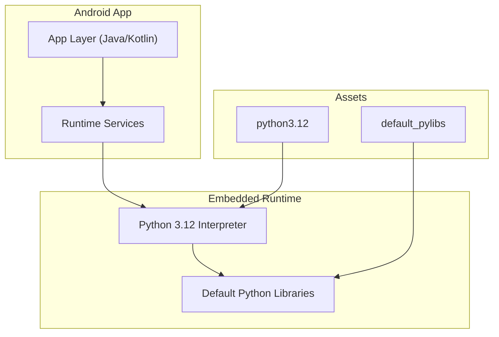
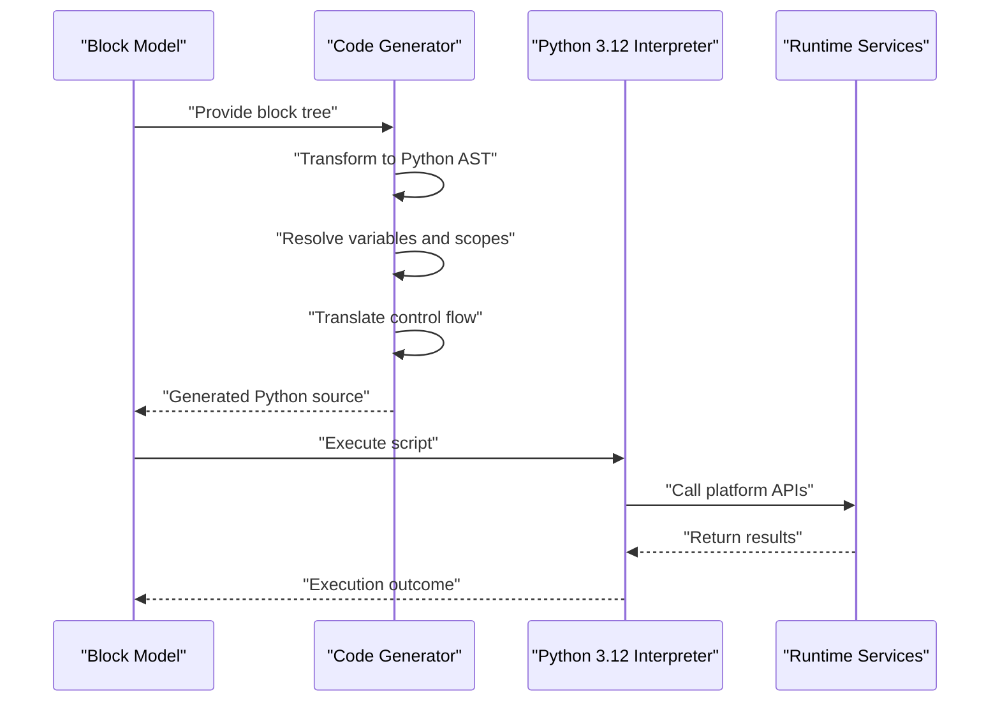
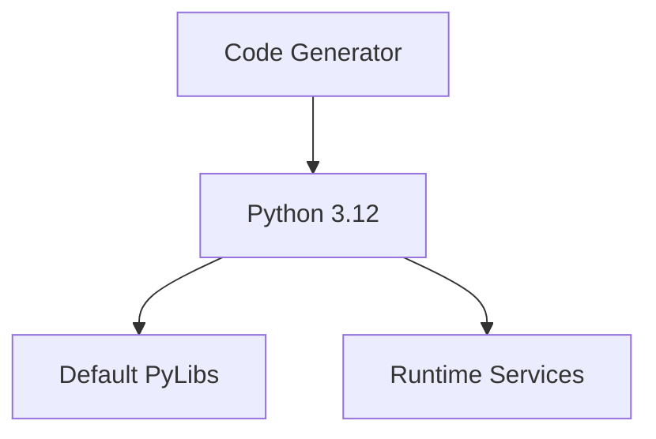

# Code Generation Engine

<cite>
**Referenced Files in This Document**
- [README.md](file://README.md)
- [catroid/src/main/assets/python3.12/README.md](file://catroid/src/main/assets/python3.12/README.md)
- [catroid/src/main/assets/default_pylibs/README.md](file://catroid/src/main/assets/default_pylibs/README.md)
- [core/src/main/java/org/catrobat/catroid/runtime/RuntimeServices.kt](file://core/src/main/java/org/catrobat/catroid/runtime/RuntimeServices.kt)
- [core/src/main/java/org/catrobat/catroid/runtime/RuntimeServicesHolder.kt](file://core/src/main/java/org/catrobat/catroid/runtime/RuntimeServicesHolder.kt)
</cite>

## Table of Contents
1. [Introduction](#introduction)
2. [Project Structure](#project-structure)
3. [Core Components](#core-components)
4. [Architecture Overview](#architecture-overview)
5. [Detailed Component Analysis](#detailed-component-analysis)
6. [Dependency Analysis](#dependency-analysis)
7. [Performance Considerations](#performance-considerations)
8. [Troubleshooting Guide](#troubleshooting-guide)
9. [Conclusion](#conclusion)
10. [Appendices](#appendices)

## Introduction
This document explains the code generation engine that transforms visual blocks into executable Python code within NewCatroid. It covers the compilation pipeline from block representation to Python syntax, AST transformation, variable scoping, control flow translation, integration with the embedded Python interpreter, memory management, performance optimization, error reporting and debugging, asynchronous and event-driven patterns, real-time preview, bytecode caching, execution profiling, runtime environment integration, library imports, external module loading, and extension points for new block types and custom language features.

The repository includes an embedded Python 3.12 runtime and default Python libraries packaged as assets. The core runtime services provide a bridge between the Android application layer and the Python execution environment.

## Project Structure
NewCatroid is primarily an Android application written in Java/Kotlin with embedded Python assets. Key areas relevant to the code generation engine include:
- Embedded Python runtime and standard libraries under assets
- Default Python libraries bundled for immediate use
- Core runtime services that expose platform capabilities to Python scripts
- Build and packaging configuration for embedding Python on Android

[No sources needed since this diagram shows conceptual structure]

**Section sources**
- [README.md](file://README.md)
- [catroid/src/main/assets/python3.12/README.md](file://catroid/src/main/assets/python3.12/README.md)
- [catroid/src/main/assets/default_pylibs/README.md](file://catroid/src/main/assets/default_pylibs/README.md)
- [core/src/main/java/org/catrobat/catroid/runtime/RuntimeServices.kt](file://core/src/main/java/org/catrobat/catroid/runtime/RuntimeServices.kt)
- [core/src/main/java/org/catrobat/catroid/runtime/RuntimeServicesHolder.kt](file://core/src/main/java/org/catrobat/catroid/runtime/RuntimeServicesHolder.kt)

## Core Components
- Python 3.12 Embedding: The project bundles a complete Python 3.12 distribution under assets, enabling execution of generated Python code directly on-device without network dependencies.
- Default Python Libraries: Additional Python packages are included under default_pylibs to extend functionality available to generated scripts.
- Runtime Services Bridge: Kotlin/Java classes expose platform services (audio, text, notifications, network, stage) to Python via the embedded interpreter, allowing generated code to interact with device capabilities.

These components together form the foundation for transforming visual blocks into runnable Python programs.

**Section sources**
- [catroid/src/main/assets/python3.12/README.md](file://catroid/src/main/assets/python3.12/README.md)
- [catroid/src/main/assets/default_pylibs/README.md](file://catroid/src/main/assets/default_pylibs/README.md)
- [core/src/main/java/org/catrobat/catroid/runtime/RuntimeServices.kt](file://core/src/main/java/org/catrobat/catroid/runtime/RuntimeServices.kt)
- [core/src/main/java/org/catrobat/catroid/runtime/RuntimeServicesHolder.kt](file://core/src/main/java/org/catrobat/catroid/runtime/RuntimeServicesHolder.kt)

## Architecture Overview
The code generation engine integrates three major layers:
- Block Representation Layer: Visual blocks define program logic through a structured representation.
- Code Generation Layer: Translates block structures into Python source code, handling AST-like transformations, scoping, and control flow mapping.
- Execution Layer: Runs generated Python code using the embedded interpreter, bridging to platform services via runtime services.

[No sources needed since this diagram shows conceptual workflow]

## Detailed Component Analysis

### Compilation Pipeline: From Blocks to Python Syntax
The pipeline converts a hierarchical block model into valid Python code:
- Parsing and Validation: Ensure blocks form a well-structured program graph.
- AST Transformation: Map block nodes to Python AST constructs (expressions, statements, functions).
- Variable Scoping: Track local and global scopes; generate appropriate declarations and references.
- Control Flow Translation: Convert loops, conditionals, and events into Python equivalents.
- Code Emission: Produce syntactically correct Python source ready for execution.

Key considerations:
- Maintain deterministic output for reproducibility and caching.
- Preserve semantic equivalence across translations.
- Optimize for readability and debuggability by including comments or markers where helpful.

[No sources needed since this section provides general guidance]

### AST Transformation and Control Flow Translation
- Expression Mapping: Arithmetic, logical, string, and list operations map to Python operators and built-ins.
- Statement Mapping: Assignments, function calls, and print/log statements translate directly.
- Control Structures: If/else, for/while loops, and try/except blocks are generated with proper indentation and nesting.
- Event Handlers: Event-driven triggers become callback functions or async handlers depending on the target pattern.

[No sources needed since this section provides general guidance]

### Variable Scoping and Name Resolution
- Scope Tracking: Maintain a stack of scopes during generation to resolve names correctly.
- Shadowing Handling: Detect and warn about variable shadowing when applicable.
- Global vs Local: Generate explicit global declarations if required by the semantics of the block model.
- Type Inference Hints: Optionally annotate variables to aid debugging and static analysis tools.

[No sources needed since this section provides general guidance]

### Python Interpreter Integration
- Initialization: Bootstrap the embedded Python 3.12 interpreter with configured paths and modules.
- Module Loading: Import default libraries and any user-provided modules from assets.
- API Bridging: Expose platform services (audio, text, notifications, network, stage) as Python-callable interfaces.
- Error Propagation: Capture exceptions and translate them into user-friendly messages.

Integration points:
- Runtime services act as the boundary between Python and Android APIs.
- Asset directories supply the interpreter and additional libraries.

**Section sources**
- [catroid/src/main/assets/python3.12/README.md](file://catroid/src/main/assets/python3.12/README.md)
- [catroid/src/main/assets/default_pylibs/README.md](file://catroid/src/main/assets/default_pylibs/README.md)
- [core/src/main/java/org/catrobat/catroid/runtime/RuntimeServices.kt](file://core/src/main/java/org/catrobat/catroid/runtime/RuntimeServices.kt)
- [core/src/main/java/org/catrobat/catroid/runtime/RuntimeServicesHolder.kt](file://core/src/main/java/org/catrobat/catroid/runtime/RuntimeServicesHolder.kt)

### Memory Management and Performance Optimization
- Interpreter Lifecycle: Initialize once per session and reuse to avoid overhead.
- Resource Cleanup: Release resources associated with long-running tasks and large objects.
- Bytecode Caching: Cache compiled .pyc artifacts where feasible to speed up repeated executions.
- Profiling Hooks: Integrate lightweight profiling to identify hotspots in generated code.
- Threading: Use background threads for I/O-bound operations to keep UI responsive.

[No sources needed since this section provides general guidance]

### Error Reporting, Syntax Validation, and Debugging
- Syntax Validation: Validate generated Python before execution to catch errors early.
- Exception Handling: Translate Python exceptions into actionable messages for users.
- Debugging Support: Provide line mappings and optional breakpoints for stepping through generated code.
- Logging: Emit structured logs for diagnostics and analytics.

[No sources needed since this section provides general guidance]

### Asynchronous Operations and Event-Driven Patterns
- Async/Await: Generate async functions for non-blocking operations like network requests or file I/O.
- Event Loop: Manage an event loop to handle callbacks and timers.
- Concurrency Safety: Ensure thread-safe interactions with shared state and platform services.

[No sources needed since this section provides general guidance]

### Real-Time Code Preview
- Incremental Generation: Update preview as blocks change without full recompilation.
- Live Execution: Run simplified versions of generated code to show immediate feedback.
- Error Highlighting: Mark problematic blocks based on validation results.

[No sources needed since this section provides general guidance]

### Runtime Environment Integration, Library Imports, and External Modules
- Standard Library Access: Leverage Python 3.12 standard library features.
- Default Libraries: Import pre-bundled packages from default_pylibs.
- External Modules: Load user-provided modules from secure locations with permission checks.
- Path Configuration: Set sys.path appropriately to locate modules and packages.

**Section sources**
- [catroid/src/main/assets/default_pylibs/README.md](file://catroid/src/main/assets/default_pylibs/README.md)

### Extending the Code Generator for New Block Types and Custom Features
- Registration Mechanism: Add new block definitions and their corresponding Python emission rules.
- Template System: Use templates for common patterns to reduce duplication.
- Testing Harness: Write unit tests for each new block type to ensure correctness.
- Documentation: Update block documentation and examples for developers and users.

[No sources needed since this section provides general guidance]

## Dependency Analysis
The code generation engine depends on:
- Embedded Python 3.12 runtime
- Default Python libraries
- Core runtime services for platform access

[No sources needed since this diagram shows conceptual relationships]

**Section sources**
- [catroid/src/main/assets/python3.12/README.md](file://catroid/src/main/assets/python3.12/README.md)
- [catroid/src/main/assets/default_pylibs/README.md](file://catroid/src/main/assets/default_pylibs/README.md)
- [core/src/main/java/org/catrobat/catroid/runtime/RuntimeServices.kt](file://core/src/main/java/org/catrobat/catroid/runtime/RuntimeServices.kt)

## Performance Considerations
- Minimize interpreter startup time by reusing sessions.
- Prefer batched operations for I/O and rendering updates.
- Use efficient data structures in generated code to reduce memory pressure.
- Profile frequently executed blocks to identify bottlenecks.
- Avoid excessive logging in production builds.

[No sources needed since this section provides general guidance]

## Troubleshooting Guide
Common issues and resolutions:
- ImportError: Verify module paths and availability in default_pylibs or external modules.
- Permission Errors: Check app permissions for file system or network access.
- Threading Issues: Ensure platform service calls are made from appropriate threads.
- Memory Leaks: Inspect long-lived objects and release references when done.
- Slow Execution: Profile hotspots and optimize algorithms or reduce unnecessary computations.

[No sources needed since this section provides general guidance]

## Conclusion
NewCatroid’s code generation engine bridges visual programming and Python execution by transforming block models into optimized, safe, and debuggable Python code. With an embedded Python 3.12 runtime, rich default libraries, and robust runtime services, it enables powerful, interactive applications while maintaining performance and reliability. Extensibility points allow developers to add new block types and custom features seamlessly.

[No sources needed since this section summarizes without analyzing specific files]

## Appendices

### Example Extension Workflow
- Define a new block schema and its parameters.
- Implement emission rules to generate corresponding Python code.
- Register the block with the generator registry.
- Add tests covering typical usage and edge cases.
- Update documentation and examples.

[No sources needed since this section provides general guidance]