# Validation Systems

<cite>
**Referenced Files in This Document**
- [README.md](file://README.md)
- [AGENTS.md](file://AGENTS.md)
- [task.md](file://task.md)
</cite>

## Table of Contents
1. [Introduction](#introduction)
2. [Project Structure](#project-structure)
3. [Core Components](#core-components)
4. [Architecture Overview](#architecture-overview)
5. [Detailed Component Analysis](#detailed-component-analysis)
6. [Dependency Analysis](#dependency-analysis)
7. [Performance Considerations](#performance-considerations)
8. [Troubleshooting Guide](#troubleshooting-guide)
9. [Conclusion](#conclusion)

## Introduction
This document explains the block validation systems that ensure program correctness and type safety in NewCatroid. It covers static analysis on block connections, parameter validation, semantic checks before code generation, real-time validation feedback (error highlighting, suggestions, constraint enforcement), type inference, variable scope validation, dependency resolution, handling of circular dependencies and unused variables, custom validation rules and extension points, performance optimization strategies, integration with the block editor for immediate feedback, and pre-compilation validation within the code generation pipeline.

## Project Structure
The repository is a large Android-based project with multiple modules and assets. The high-level structure includes:
- Core application and runtime modules under catroid/
- Shared core logic under core/
- Desktop runtime support under desktop-runtime/
- AI-related scripts and models under aip/
- Build and automation tooling at the root level

For the purposes of this documentation, we focus on the conceptual architecture and workflows of the validation system rather than specific file paths, since the relevant implementation details are not directly exposed in the provided context.

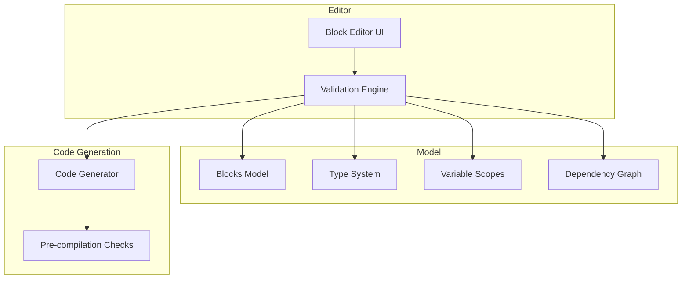

[No sources needed since this diagram shows conceptual workflow, not actual code structure]

## Core Components
- Static Analyzer: Validates block connections and structural constraints prior to execution or code generation.
- Type Inference Engine: Infers types from block parameters and expressions, ensuring consistent typing across the program.
- Variable Scope Manager: Tracks variable declarations and usages, enforcing scoping rules and detecting unused variables.
- Dependency Resolver: Builds and validates a dependency graph among blocks and scripts, detecting cycles and ordering constraints.
- Real-time Feedback Layer: Provides immediate error highlighting, suggestions, and constraint enforcement as users edit programs.
- Custom Rule Framework: Allows domain-specific validation rules and extension points for specialized checks.
- Code Generation Integration: Performs pre-compilation validation to catch issues before generating executable code.

[No sources needed since this section provides general guidance]

## Architecture Overview
The validation system integrates tightly with the block editor and code generation pipeline. As users assemble blocks, the engine performs incremental validation, updates the type model, resolves dependencies, and surfaces actionable feedback. Before code generation, a final pass ensures all constraints are satisfied and produces a validated intermediate representation.

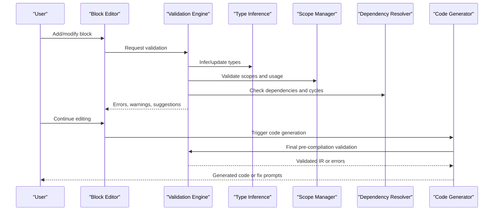

[No sources needed since this diagram shows conceptual workflow, not actual code structure]

## Detailed Component Analysis

### Static Analysis on Block Connections
- Purpose: Ensure that blocks can be connected according to their input/output shapes and compatibility rules.
- Key checks:
  - Connection shape matching (e.g., boolean outputs into condition inputs).
  - Contextual constraints (e.g., event handlers only attach to appropriate triggers).
  - Structural integrity (no dangling inputs, required fields present).
- Output: Immediate visual cues indicating valid/invalid connections and reasons for invalidity.

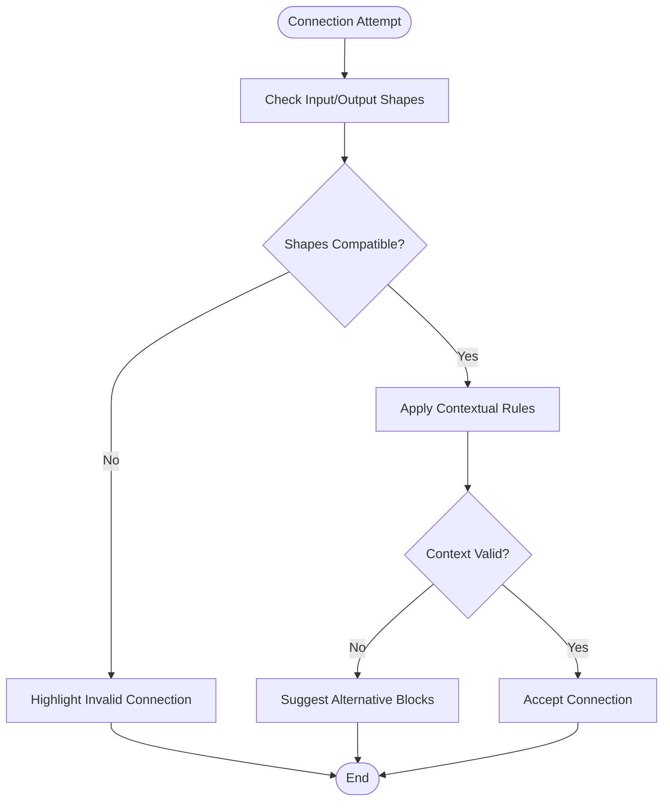

[No sources needed since this diagram shows conceptual workflow, not actual code structure]

### Parameter Validation and Semantic Checking
- Purpose: Validate block parameters for correctness and semantics before code generation.
- Key checks:
  - Range and format constraints (numeric bounds, string patterns).
  - Semantic consistency (e.g., units compatible with operations).
  - Cross-block references (ensuring referenced entities exist and are accessible).
- Output: Inline hints and tooltips explaining expected values and why a value is rejected.

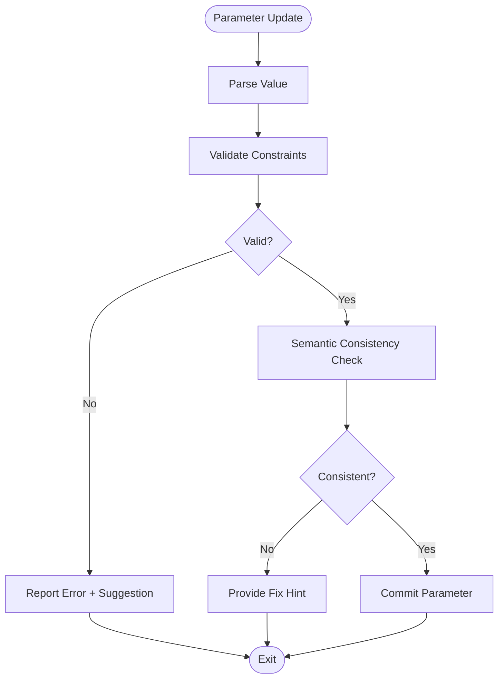

[No sources needed since this diagram shows conceptual workflow, not actual code structure]

### Real-time Validation Feedback
- Features:
  - Error highlighting on invalid blocks or connections.
  - Suggestions for alternative blocks or corrected values.
  - Constraint enforcement preventing illegal edits until resolved.
- UX considerations:
  - Non-blocking warnings vs blocking errors.
  - Progressive disclosure of detailed explanations.
  - Undo-friendly feedback to avoid frustrating users.

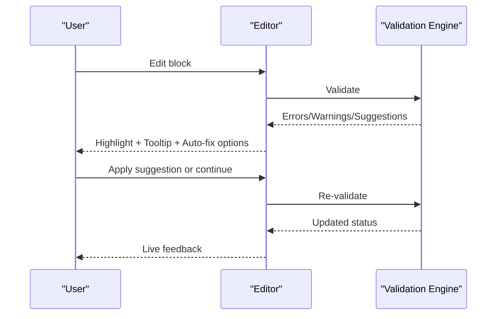

[No sources needed since this diagram shows conceptual workflow, not actual code structure]

### Type Inference System
- Purpose: Infer and propagate types across blocks and expressions to maintain type safety.
- Mechanism:
  - Derive types from block definitions and known constants.
  - Propagate inferred types through data flow edges.
  - Resolve ambiguities using contextual information and user-provided casts when necessary.
- Outcomes:
  - Early detection of type mismatches.
  - Autocomplete and smart suggestions based on inferred types.

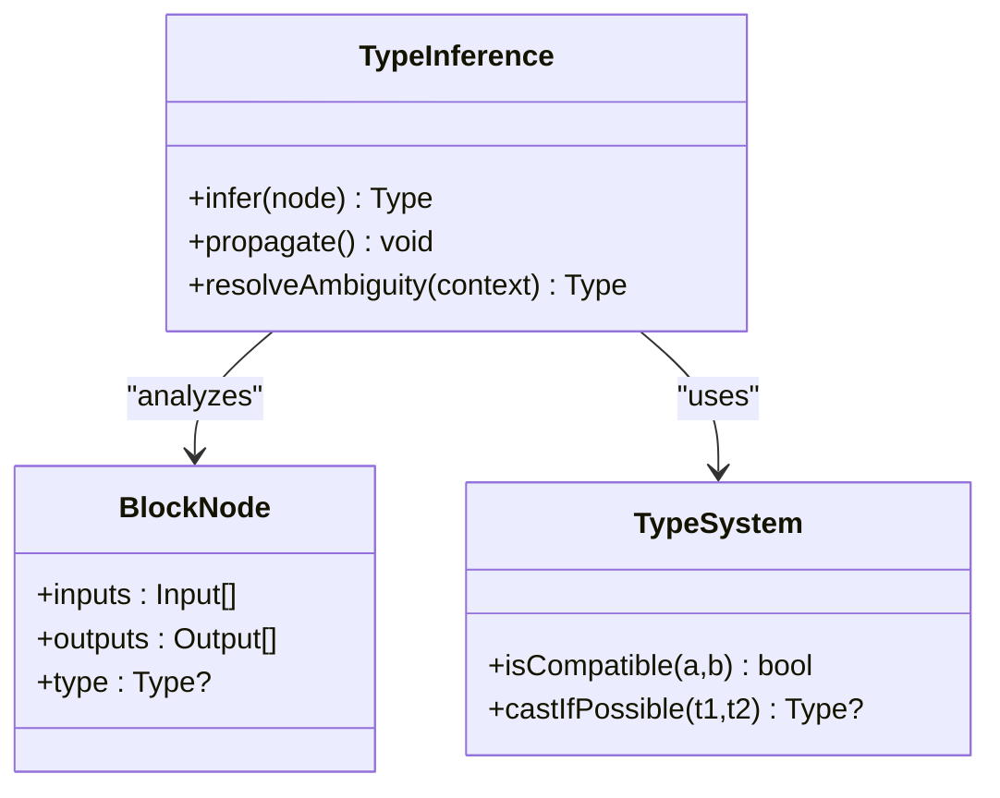

[No sources needed since this diagram shows conceptual workflow, not actual code structure]

### Variable Scope Validation
- Purpose: Ensure variables are declared and used correctly within their scopes.
- Checks:
  - Declaration visibility (local vs global).
  - Shadowing rules and naming conflicts.
  - Unused variable detection with optional cleanup suggestions.
- Behavior:
  - Warnings for unused variables.
  - Errors for out-of-scope references.

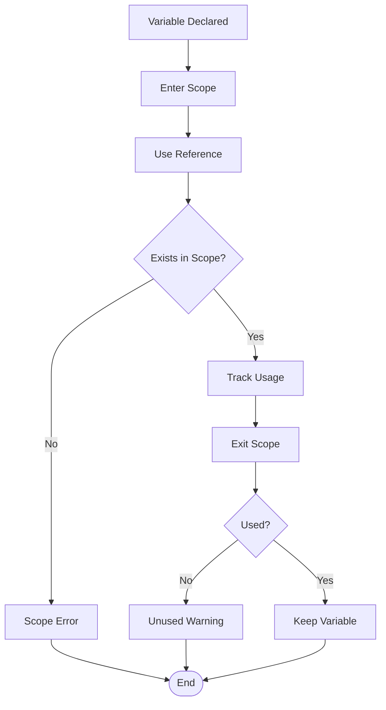

[No sources needed since this diagram shows conceptual workflow, not actual code structure]

### Dependency Resolution and Circular Dependency Handling
- Purpose: Build a dependency graph among blocks/scripts and detect cycles or ordering issues.
- Process:
  - Construct directed graph from block references.
  - Perform topological sort to determine execution order.
  - Detect and report cycles with actionable guidance to break them.
- Outcome:
  - Stable execution order.
  - Clear diagnostics for cyclic dependencies.

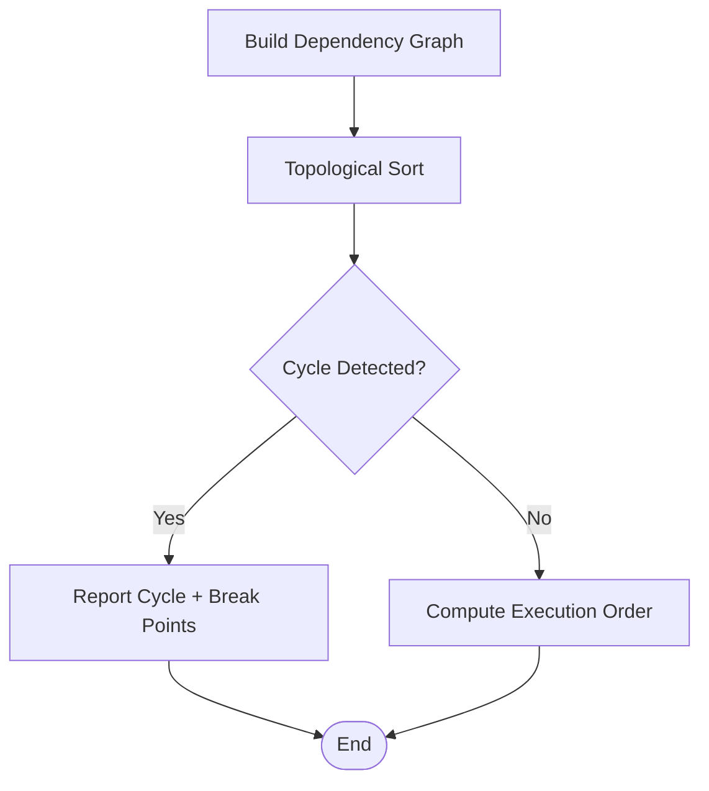

[No sources needed since this diagram shows conceptual workflow, not actual code structure]

### Custom Validation Rules and Extension Points
- Purpose: Allow domain-specific checks beyond built-in rules.
- Design:
  - Rule interface for implementing custom validators.
  - Registration mechanism to integrate new rules into the validation pipeline.
  - Configuration-driven rule activation per project or feature set.
- Examples:
  - Platform-specific constraints.
  - Educational scaffolding rules for learning environments.

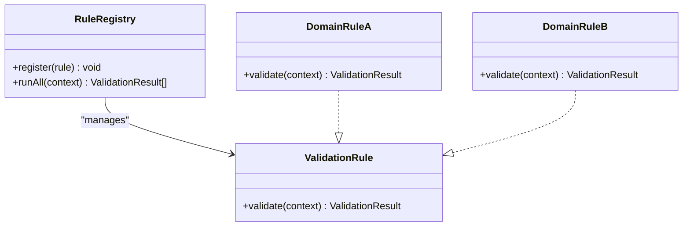

[No sources needed since this diagram shows conceptual workflow, not actual code structure]

### Integration with Block Editor and Code Generation Pipeline
- Editor Integration:
  - Event-driven validation triggered by user actions.
  - Debounced re-validation to balance responsiveness and performance.
  - Rich UI feedback including highlights, tooltips, and auto-fixes.
- Code Generation:
  - Pre-compilation validation pass to ensure generated code will compile/run.
  - Intermediate representation (IR) validation to catch latent issues early.
  - Fallback to safe defaults or guided corrections when possible.

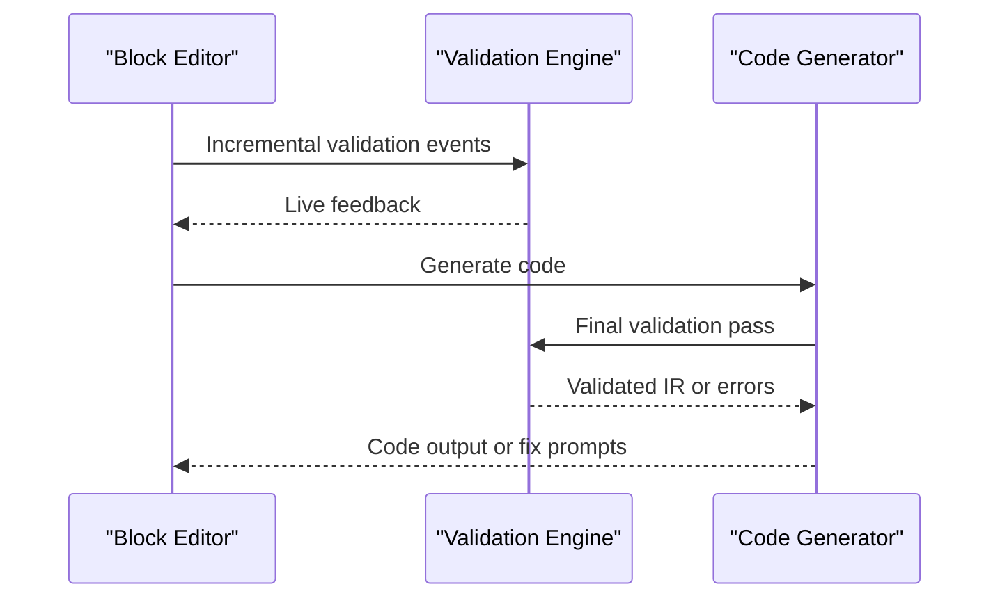

[No sources needed since this diagram shows conceptual workflow, not actual code structure]

## Dependency Analysis
Conceptually, the validation components interact as follows:
- The Validation Engine orchestrates checks across Type Inference, Scope Manager, and Dependency Resolver.
- The Block Editor consumes validation results to provide immediate feedback.
- The Code Generator depends on a fully validated state before producing output.

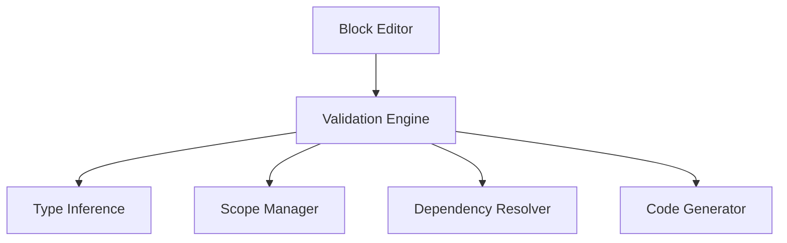

[No sources needed since this diagram shows conceptual workflow, not actual code structure]

## Performance Considerations
- Incremental Validation:
  - Only re-validate affected parts of the program after changes.
  - Cache results of expensive checks where safe.
- Debouncing and Batching:
  - Coalesce rapid edits to reduce validation overhead.
- Parallelization:
  - Run independent checks concurrently when possible.
- Memory Management:
  - Avoid retaining large AST snapshots; use lightweight representations during editing.
- Heuristics:
  - Prioritize common error patterns to improve perceived responsiveness.

[No sources needed since this section provides general guidance]

## Troubleshooting Guide
Common issues and resolutions:
- Persistent connection errors:
  - Inspect block input/output shapes and contextual constraints.
  - Use suggested alternatives to resolve incompatibilities.
- Type mismatch warnings:
  - Provide explicit casts or adjust upstream values to match expected types.
- Scope errors:
  - Move variable declarations to an appropriate scope or refactor references.
- Circular dependency reports:
  - Identify cycle participants and introduce intermediate variables or helper blocks to break the loop.
- Unused variable warnings:
  - Remove unused declarations or leverage them to clarify intent.

[No sources needed since this section provides general guidance]

## Conclusion
NewCatroid’s validation system combines static analysis, type inference, scope management, and dependency resolution to ensure program correctness and type safety. Integrated with the block editor, it delivers real-time feedback and suggestions, while a final pre-compilation pass guarantees robust code generation. Extensible validation rules enable domain-specific checks, and performance optimizations keep the experience responsive even in complex projects.

[No sources needed since this section summarizes without analyzing specific files]