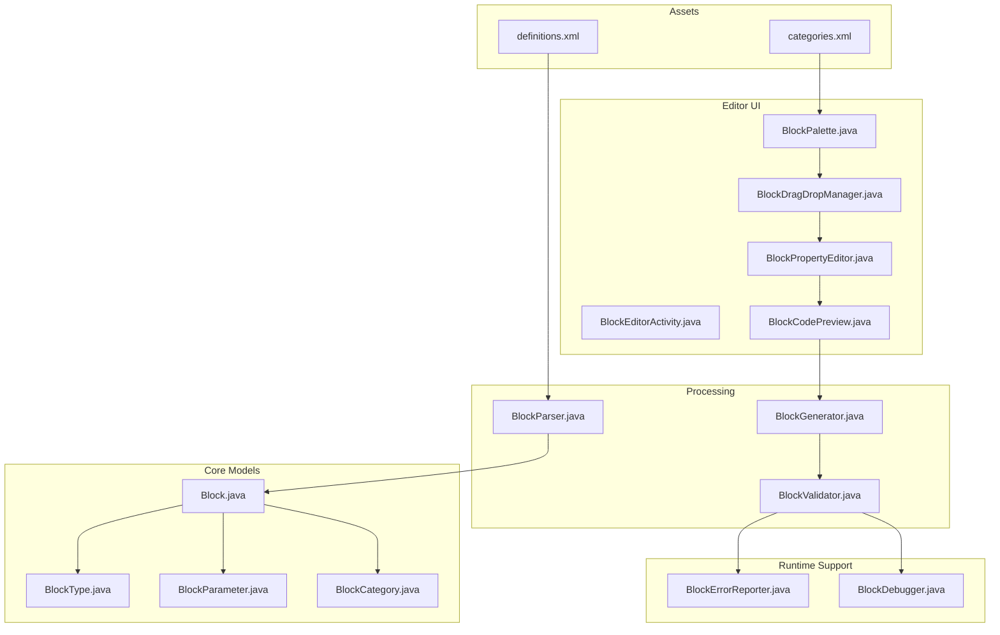
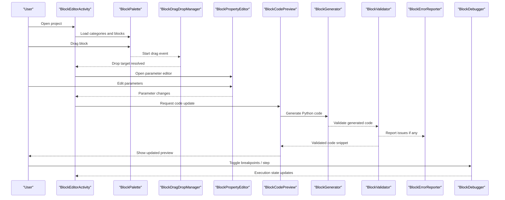
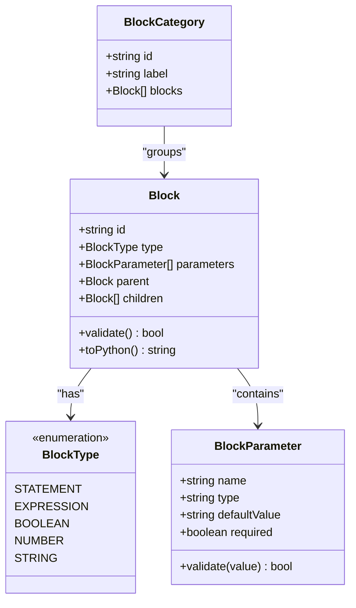
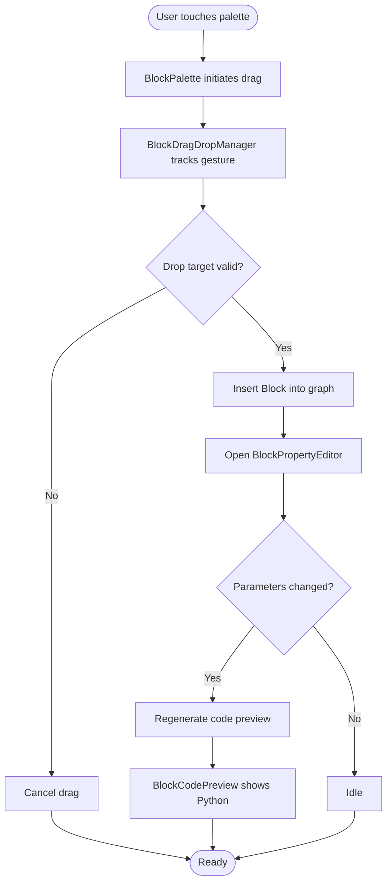
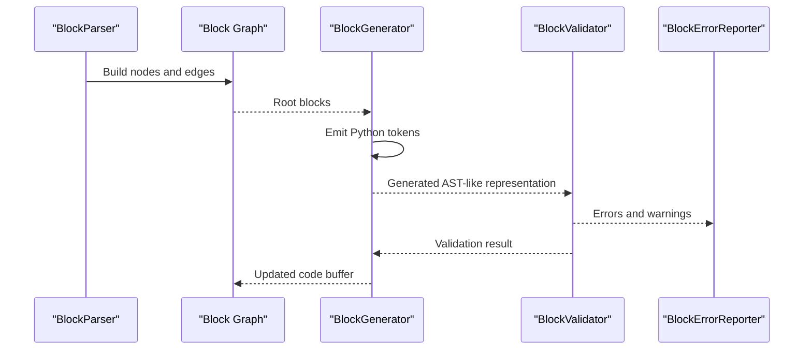
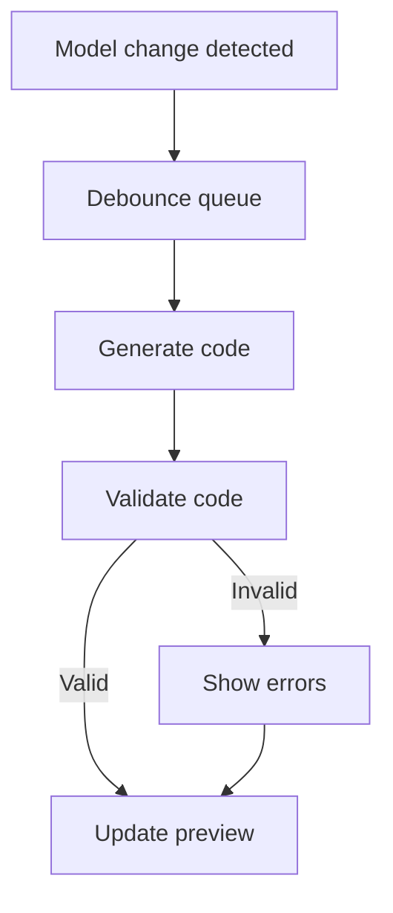
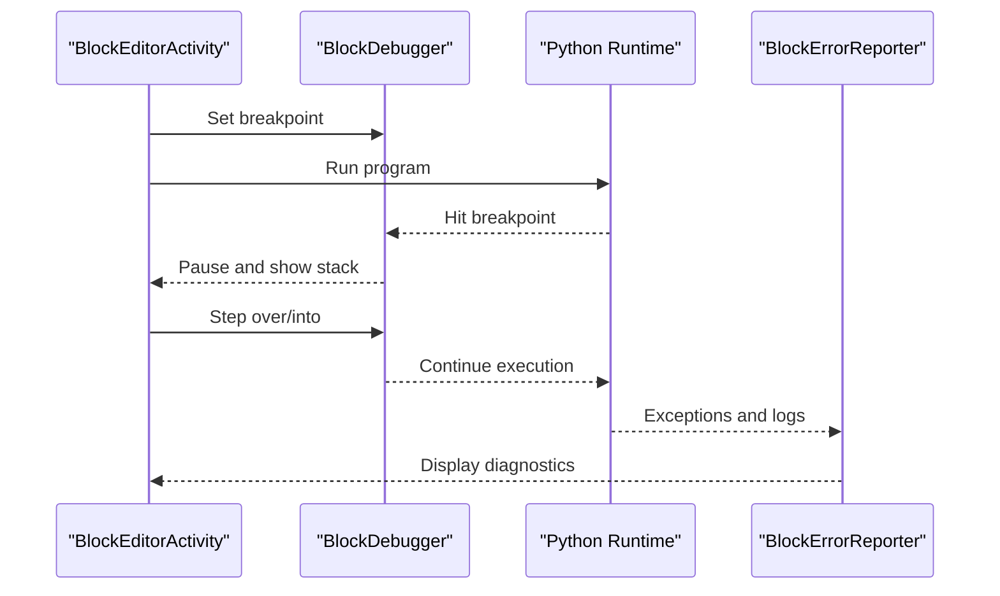
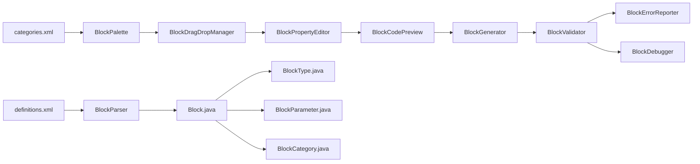

# Visual Programming System

<cite>
**Referenced Files in This Document**
- [README.md](file://README.md)
- [catroid/src/main/assets/catblocks/definitions.xml](file://catroid/src/main/assets/catblocks/definitions.xml)
- [catroid/src/main/assets/catblocks/categories.xml](file://catroid/src/main/assets/catblocks/categories.xml)
- [catroid/src/main/java/org/catrobat/catroid/paint/activities/BlockEditorActivity.java](file://catroid/src/main/java/org/catrobat/catroid/paint/activities/BlockEditorActivity.java)
- [catroid/src/main/java/org/catrobat/catroid/codeeditor/blocks/Block.java](file://catroid/src/main/java/org/catrobat/catroid/codeeditor/blocks/Block.java)
- [catroid/src/main/java/org/catrobat/catroid/codeeditor/blocks/BlockType.java](file://catroid/src/main/java/org/catrobat/catroid/codeeditor/blocks/BlockType.java)
- [catroid/src/main/java/org/catrobat/catroid/codeeditor/blocks/BlockParameter.java](file://catroid/src/main/java/org/catrobat/catroid/codeeditor/blocks/BlockParameter.java)
- [catroid/src/main/java/org/catrobat/catroid/codeeditor/blocks/BlockCategory.java](file://catroid/src/main/java/org/catrobat/catroid/codeeditor/blocks/BlockCategory.java)
- [catroid/src/main/java/org/catrobat/catroid/codeeditor/blocks/BlockParser.java](file://catroid/src/main/java/org/catrobat/catroid/codeeditor/blocks/BlockParser.java)
- [catroid/src/main/java/org/catrobat/catroid/codeeditor/blocks/BlockGenerator.java](file://catroid/src/main/java/org/catrobat/catroid/codeeditor/blocks/BlockGenerator.java)
- [catroid/src/main/java/org/catrobat/catroid/codeeditor/blocks/BlockValidator.java](file://catroid/src/main/java/org/catrobat/catroid/codeeditor/blocks/BlockValidator.java)
- [catroid/src/main/java/org/catrobat/catroid/codeeditor/blocks/BlockPalette.java](file://catroid/src/main/java/org/catrobat/catroid/codeeditor/blocks/BlockPalette.java)
- [catroid/src/main/java/org/catrobat/catroid/codeeditor/blocks/BlockDragDropManager.java](file://catroid/src/main/java/org/catrobat/catroid/codeeditor/blocks/BlockDragDropManager.java)
- [catroid/src/main/java/org/catrobat/catroid/codeeditor/blocks/BlockPropertyEditor.java](file://catroid/src/main/java/org/catrobat/catroid/codeeditor/blocks/BlockPropertyEditor.java]
- [catroid/src/main/java/org/catrobat/catroid/codeeditor/blocks/BlockCodePreview.java](file://catroid/src/main/java/org/catrobat/catroid/codeeditor/blocks/BlockCodePreview.java)
- [catroid/src/main/java/org/catrobat/catroid/codeeditor/blocks/BlockErrorReporter.java](file://catroid/src/main/java/org/catrobat/catroid/codeeditor/blocks/BlockErrorReporter.java)
- [catroid/src/main/java/org/catrobat/catroid/codeeditor/blocks/BlockDebugger.java](file://catroid/src/main/java/org/catrobat/catroid/codeeditor/blocks/BlockDebugger.java)
</cite>

## Table of Contents
1. [Introduction](#introduction)
2. [Project Structure](#project-structure)
3. [Core Components](#core-components)
4. [Architecture Overview](#architecture-overview)
5. [Detailed Component Analysis](#detailed-component-analysis)
6. [Dependency Analysis](#dependency-analysis)
7. [Performance Considerations](#performance-considerations)
8. [Troubleshooting Guide](#troubleshooting-guide)
9. [Conclusion](#conclusion)
10. [Appendices](#appendices)

## Introduction
This document explains NewCatroid’s visual programming system: the block-based paradigm, how visual blocks translate to executable Python code, and the complete lifecycle from user interaction to program execution. It covers the block editor interface, drag-and-drop operations, block properties and parameters, real-time code generation, the block definition schema, validation rules, type safety mechanisms, the code generation engine, error handling strategies, debugging capabilities, and practical examples for extending the system with custom blocks and new constructs.

## Project Structure
The visual programming system is implemented primarily within the Catroid Android application module. The key areas include:
- Block definitions and categories stored as assets
- Core block model classes and runtime behaviors
- Editor UI components for building programs visually
- Code generation and validation pipelines
- Drag-and-drop management and palette rendering
- Error reporting and debugging utilities

**Diagram sources**
- [catroid/src/main/assets/catblocks/definitions.xml](file://catroid/src/main/assets/catblocks/definitions.xml)
- [catroid/src/main/assets/catblocks/categories.xml](file://catroid/src/main/assets/catblocks/categories.xml)
- [catroid/src/main/java/org/catrobat/catroid/paint/activities/BlockEditorActivity.java](file://catroid/src/main/java/org/catrobat/catroid/paint/activities/BlockEditorActivity.java)
- [catroid/src/main/java/org/catrobat/catroid/codeeditor/blocks/BlockPalette.java](file://catroid/src/main/java/org/catrobat/catroid/codeeditor/blocks/BlockPalette.java)
- [catroid/src/main/java/org/catrobat/catroid/codeeditor/blocks/BlockDragDropManager.java](file://catroid/src/main/java/org/catrobat/catroid/codeeditor/blocks/BlockDragDropManager.java)
- [catroid/src/main/java/org/catrobat/catroid/codeeditor/blocks/BlockPropertyEditor.java](file://catroid/src/main/java/org/catrobat/catroid/codeeditor/blocks/BlockPropertyEditor.java)
- [catroid/src/main/java/org/catrobat/catroid/codeeditor/blocks/BlockCodePreview.java](file://catroid/src/main/java/org/catrobat/catroid/codeeditor/blocks/BlockCodePreview.java)
- [catroid/src/main/java/org/catrobat/catroid/codeeditor/blocks/BlockParser.java](file://catroid/src/main/java/org/catrobat/catroid/codeeditor/blocks/BlockParser.java)
- [catroid/src/main/java/org/catrobat/catroid/codeeditor/blocks/BlockGenerator.java](file://catroid/src/main/java/org/catrobat/catroid/codeeditor/blocks/BlockGenerator.java)
- [catroid/src/main/java/org/catrobat/catroid/codeeditor/blocks/BlockValidator.java](file://catroid/src/main/java/org/catrobat/catroid/codeeditor/blocks/BlockValidator.java)
- [catroid/src/main/java/org/catrobat/catroid/codeeditor/blocks/BlockErrorReporter.java](file://catroid/src/main/java/org/catrobat/catroid/codeeditor/blocks/BlockErrorReporter.java)
- [catroid/src/main/java/org/catrobat/catroid/codeeditor/blocks/BlockDebugger.java](file://catroid/src/main/java/org/catrobat/catroid/codeeditor/blocks/BlockDebugger.java)

**Section sources**
- [README.md](file://README.md)

## Core Components
- Block model and metadata:
  - Block: Represents a single visual instruction or expression node.
  - BlockType: Enumerates supported block kinds (e.g., statements, expressions).
  - BlockParameter: Defines typed inputs, labels, and default values.
  - BlockCategory: Groups blocks into logical sections (e.g., Motion, Looks).
- Editor UI:
  - BlockEditorActivity: Hosts the visual workspace and orchestrates interactions.
  - BlockPalette: Renders available blocks by category.
  - BlockDragDropManager: Handles drag-and-drop semantics and snapping.
  - BlockPropertyEditor: Edits block parameters inline.
  - BlockCodePreview: Shows generated Python code in real time.
- Processing pipeline:
  - BlockParser: Parses serialized block graphs into in-memory structures.
  - BlockGenerator: Translates block graphs to Python source code.
  - BlockValidator: Enforces constraints and type safety before generation.
- Runtime support:
  - BlockErrorReporter: Aggregates and displays errors/warnings.
  - BlockDebugger: Provides breakpoints, step-through, and variable inspection.

**Section sources**
- [catroid/src/main/java/org/catrobat/catroid/codeeditor/blocks/Block.java](file://catroid/src/main/java/org/catrobat/catroid/codeeditor/blocks/Block.java)
- [catroid/src/main/java/org/catrobat/catroid/codeeditor/blocks/BlockType.java](file://catroid/src/main/java/org/catrobat/catroid/codeeditor/blocks/BlockType.java)
- [catroid/src/main/java/org/catrobat/catroid/codeeditor/blocks/BlockParameter.java](file://catroid/src/main/java/org/catrobat/catroid/codeeditor/blocks/BlockParameter.java)
- [catroid/src/main/java/org/catrobat/catroid/codeeditor/blocks/BlockCategory.java](file://catroid/src/main/java/org/catrobat/catroid/codeeditor/blocks/BlockCategory.java)
- [catroid/src/main/java/org/catrobat/catroid/paint/activities/BlockEditorActivity.java](file://catroid/src/main/java/org/catrobat/catroid/paint/activities/BlockEditorActivity.java)
- [catroid/src/main/java/org/catrobat/catroid/codeeditor/blocks/BlockPalette.java](file://catroid/src/main/java/org/catrobat/catroid/codeeditor/blocks/BlockPalette.java)
- [catroid/src/main/java/org/catrobat/catroid/codeeditor/blocks/BlockDragDropManager.java](file://catroid/src/main/java/org/catrobat/catroid/codeeditor/blocks/BlockDragDropManager.java)
- [catroid/src/main/java/org/catrobat/catroid/codeeditor/blocks/BlockPropertyEditor.java](file://catroid/src/main/java/org/catrobat/catroid/codeeditor/blocks/BlockPropertyEditor.java)
- [catroid/src/main/java/org/catrobat/catroid/codeeditor/blocks/BlockCodePreview.java](file://catroid/src/main/java/org/catrobat/catroid/codeeditor/blocks/BlockCodePreview.java)
- [catroid/src/main/java/org/catrobat/catroid/codeeditor/blocks/BlockParser.java](file://catroid/src/main/java/org/catrobat/catroid/codeeditor/blocks/BlockParser.java)
- [catroid/src/main/java/org/catrobat/catroid/codeeditor/blocks/BlockGenerator.java](file://catroid/src/main/java/org/catrobat/catroid/codeeditor/blocks/BlockGenerator.java)
- [catroid/src/main/java/org/catrobat/catroid/codeeditor/blocks/BlockValidator.java](file://catroid/src/main/java/org/catrobat/catroid/codeeditor/blocks/BlockValidator.java)
- [catroid/src/main/java/org/catrobat/catroid/codeeditor/blocks/BlockErrorReporter.java](file://catroid/src/main/java/org/catrobat/catroid/codeeditor/blocks/BlockErrorReporter.java)
- [catroid/src/main/java/org/catrobat/catroid/codeeditor/blocks/BlockDebugger.java](file://catroid/src/main/java/org/catrobat/catroid/codeeditor/blocks/BlockDebugger.java)

## Architecture Overview
The visual programming system follows a layered architecture:
- Presentation layer: Editor activity, palette, property editor, and preview.
- Interaction layer: Drag-and-drop manager coordinating user gestures.
- Model layer: Block graph representing the program structure.
- Processing layer: Parser, generator, and validator.
- Support layer: Error reporting and debugging.

**Diagram sources**
- [catroid/src/main/java/org/catrobat/catroid/paint/activities/BlockEditorActivity.java](file://catroid/src/main/java/org/catrobat/catroid/paint/activities/BlockEditorActivity.java)
- [catroid/src/main/java/org/catrobat/catroid/codeeditor/blocks/BlockPalette.java](file://catroid/src/main/java/org/catrobat/catroid/codeeditor/blocks/BlockPalette.java)
- [catroid/src/main/java/org/catrobat/catroid/codeeditor/blocks/BlockDragDropManager.java](file://catroid/src/main/java/org/catrobat/catroid/codeeditor/blocks/BlockDragDropManager.java)
- [catroid/src/main/java/org/catrobat/catroid/codeeditor/blocks/BlockPropertyEditor.java](file://catroid/src/main/java/org/catrobat/catroid/codeeditor/blocks/BlockPropertyEditor.java)
- [catroid/src/main/java/org/catrobat/catroid/codeeditor/blocks/BlockCodePreview.java](file://catroid/src/main/java/org/catrobat/catroid/codeeditor/blocks/BlockCodePreview.java)
- [catroid/src/main/java/org/catrobat/catroid/codeeditor/blocks/BlockGenerator.java](file://catroid/src/main/java/org/catrobat/catroid/codeeditor/blocks/BlockGenerator.java)
- [catroid/src/main/java/org/catrobat/catroid/codeeditor/blocks/BlockValidator.java](file://catroid/src/main/java/org/catrobat/catroid/codeeditor/blocks/BlockValidator.java)
- [catroid/src/main/java/org/catrobat/catroid/codeeditor/blocks/BlockErrorReporter.java](file://catroid/src/main/java/org/catrobat/catroid/codeeditor/blocks/BlockErrorReporter.java)
- [catroid/src/main/java/org/catrobat/catroid/codeeditor/blocks/BlockDebugger.java](file://catroid/src/main/java/org/catrobat/catroid/codeeditor/blocks/BlockDebugger.java)

## Detailed Component Analysis

### Block Definition Schema and Categories
- definitions.xml defines each block’s ID, label, parameters, return type, and behavior flags.
- categories.xml organizes blocks into palettes and determines ordering and visibility.

Key responsibilities:
- Provide machine-readable descriptions of blocks.
- Drive dynamic UI creation for palettes and editors.
- Supply metadata consumed by parser/generator/validator.

**Section sources**
- [catroid/src/main/assets/catblocks/definitions.xml](file://catroid/src/main/assets/catblocks/definitions.xml)
- [catroid/src/main/assets/catblocks/categories.xml](file://catroid/src/main/assets/catblocks/categories.xml)

### Block Model and Type Safety
- Block encapsulates identity, parent-child relationships, and parameter values.
- BlockType constrains usage contexts (e.g., statement vs. expression).
- BlockParameter enforces input types, ranges, and defaults.
- BlockCategory groups related blocks and drives palette rendering.

**Diagram sources**
- [catroid/src/main/java/org/catrobat/catroid/codeeditor/blocks/Block.java](file://catroid/src/main/java/org/catrobat/catroid/codeeditor/blocks/Block.java)
- [catroid/src/main/java/org/catrobat/catroid/codeeditor/blocks/BlockType.java](file://catroid/src/main/java/org/catrobat/catroid/codeeditor/blocks/BlockType.java)
- [catroid/src/main/java/org/catrobat/catroid/codeeditor/blocks/BlockParameter.java](file://catroid/src/main/java/org/catrobat/catroid/codeeditor/blocks/BlockParameter.java)
- [catroid/src/main/java/org/catrobat/catroid/codeeditor/blocks/BlockCategory.java](file://catroid/src/main/java/org/catrobat/catroid/codeeditor/blocks/BlockCategory.java)

**Section sources**
- [catroid/src/main/java/org/catrobat/catroid/codeeditor/blocks/Block.java](file://catroid/src/main/java/org/catrobat/catroid/codeeditor/blocks/Block.java)
- [catroid/src/main/java/org/catrobat/catroid/codeeditor/blocks/BlockType.java](file://catroid/src/main/java/org/catrobat/catroid/codeeditor/blocks/BlockType.java)
- [catroid/src/main/java/org/catrobat/catroid/codeeditor/blocks/BlockParameter.java](file://catroid/src/main/java/org/catrobat/catroid/codeeditor/blocks/BlockParameter.java)
- [catroid/src/main/java/org/catrobat/catroid/codeeditor/blocks/BlockCategory.java](file://catroid/src/main/java/org/catrobat/catroid/codeeditor/blocks/BlockCategory.java)

### Editor Interface and Drag-and-Drop Operations
- BlockEditorActivity hosts the canvas, manages selection, and coordinates subsystems.
- BlockPalette renders categorized blocks and supports search/filtering.
- BlockDragDropManager interprets touch/mouse events, handles snapping, nesting, and undo/redo integration.
- BlockPropertyEditor provides context-sensitive controls for each parameter type.
- BlockCodePreview updates generated Python code reactively on edits.

**Diagram sources**
- [catroid/src/main/java/org/catrobat/catroid/paint/activities/BlockEditorActivity.java](file://catroid/src/main/java/org/catrobat/catroid/paint/activities/BlockEditorActivity.java)
- [catroid/src/main/java/org/catrobat/catroid/codeeditor/blocks/BlockPalette.java](file://catroid/src/main/java/org/catrobat/catroid/codeeditor/blocks/BlockPalette.java)
- [catroid/src/main/java/org/catrobat/catroid/codeeditor/blocks/BlockDragDropManager.java](file://catroid/src/main/java/org/catrobat/catroid/codeeditor/blocks/BlockDragDropManager.java)
- [catroid/src/main/java/org/catrobat/catroid/codeeditor/blocks/BlockPropertyEditor.java](file://catroid/src/main/java/org/catrobat/catroid/codeeditor/blocks/BlockPropertyEditor.java)
- [catroid/src/main/java/org/catrobat/catroid/codeeditor/blocks/BlockCodePreview.java](file://catroid/src/main/java/org/catrobat/catroid/codeeditor/blocks/BlockCodePreview.java)

**Section sources**
- [catroid/src/main/java/org/catrobat/catroid/paint/activities/BlockEditorActivity.java](file://catroid/src/main/java/org/catrobat/catroid/paint/activities/BlockEditorActivity.java)
- [catroid/src/main/java/org/catrobat/catroid/codeeditor/blocks/BlockPalette.java](file://catroid/src/main/java/org/catrobat/catroid/codeeditor/blocks/BlockPalette.java)
- [catroid/src/main/java/org/catrobat/catroid/codeeditor/blocks/BlockDragDropManager.java](file://catroid/src/main/java/org/catrobat/catroid/codeeditor/blocks/BlockDragDropManager.java)
- [catroid/src/main/java/org/catrobat/catroid/codeeditor/blocks/BlockPropertyEditor.java](file://catroid/src/main/java/org/catrobat/catroid/codeeditor/blocks/BlockPropertyEditor.java)
- [catroid/src/main/java/org/catrobat/catroid/codeeditor/blocks/BlockCodePreview.java](file://catroid/src/main/java/org/catrobat/catroid/codeeditor/blocks/BlockCodePreview.java)

### Parsing, Generation, and Validation Pipeline
- BlockParser reads serialized block graphs (from projects or clipboard) and constructs the in-memory model.
- BlockGenerator traverses the block graph and emits Python syntax according to block definitions.
- BlockValidator checks semantic constraints (e.g., type compatibility, missing required parameters), producing diagnostics.

**Diagram sources**
- [catroid/src/main/java/org/catrobat/catroid/codeeditor/blocks/BlockParser.java](file://catroid/src/main/java/org/catrobat/catroid/codeeditor/blocks/BlockParser.java)
- [catroid/src/main/java/org/catrobat/catroid/codeeditor/blocks/BlockGenerator.java](file://catroid/src/main/java/org/catrobat/catroid/codeeditor/blocks/BlockGenerator.java)
- [catroid/src/main/java/org/catrobat/catroid/codeeditor/blocks/BlockValidator.java](file://catroid/src/main/java/org/catrobat/catroid/codeeditor/blocks/BlockValidator.java)
- [catroid/src/main/java/org/catrobat/catroid/codeeditor/blocks/BlockErrorReporter.java](file://catroid/src/main/java/org/catrobat/catroid/codeeditor/blocks/BlockErrorReporter.java)

**Section sources**
- [catroid/src/main/java/org/catrobat/catroid/codeeditor/blocks/BlockParser.java](file://catroid/src/main/java/org/catrobat/catroid/codeeditor/blocks/BlockParser.java)
- [catroid/src/main/java/org/catrobat/catroid/codeeditor/blocks/BlockGenerator.java](file://catroid/src/main/java/org/catrobat/catroid/codeeditor/blocks/BlockGenerator.java)
- [catroid/src/main/java/org/catrobat/catroid/codeeditor/blocks/BlockValidator.java](file://catroid/src/main/java/org/catrobat/catroid/codeeditor/blocks/BlockValidator.java)
- [catroid/src/main/java/org/catrobat/catroid/codeeditor/blocks/BlockErrorReporter.java](file://catroid/src/main/java/org/catrobat/catroid/codeeditor/blocks/BlockErrorReporter.java)

### Real-Time Code Generation and Preview
- BlockCodePreview listens to model changes and triggers regeneration.
- BlockGenerator produces syntactically correct Python snippets per block.
- BlockValidator ensures correctness before display; errors are surfaced via BlockErrorReporter.

**Diagram sources**
- [catroid/src/main/java/org/catrobat/catroid/codeeditor/blocks/BlockCodePreview.java](file://catroid/src/main/java/org/catrobat/catroid/codeeditor/blocks/BlockCodePreview.java)
- [catroid/src/main/java/org/catrobat/catroid/codeeditor/blocks/BlockGenerator.java](file://catroid/src/main/java/org/catrobat/catroid/codeeditor/blocks/BlockGenerator.java)
- [catroid/src/main/java/org/catrobat/catroid/codeeditor/blocks/BlockValidator.java](file://catroid/src/main/java/org/catrobat/catroid/codeeditor/blocks/BlockValidator.java)
- [catroid/src/main/java/org/catrobat/catroid/codeeditor/blocks/BlockErrorReporter.java](file://catroid/src/main/java/org/catrobat/catroid/codeeditor/blocks/BlockErrorReporter.java)

**Section sources**
- [catroid/src/main/java/org/catrobat/catroid/codeeditor/blocks/BlockCodePreview.java](file://catroid/src/main/java/org/catrobat/catroid/codeeditor/blocks/BlockCodePreview.java)
- [catroid/src/main/java/org/catrobat/catroid/codeeditor/blocks/BlockGenerator.java](file://catroid/src/main/java/org/catrobat/catroid/codeeditor/blocks/BlockGenerator.java)
- [catroid/src/main/java/org/catrobat/catroid/codeeditor/blocks/BlockValidator.java](file://catroid/src/main/java/org/catrobat/catroid/codeeditor/blocks/BlockValidator.java)
- [catroid/src/main/java/org/catrobat/catroid/codeeditor/blocks/BlockErrorReporter.java](file://catroid/src/main/java/org/catrobat/catroid/codeeditor/blocks/BlockErrorReporter.java)

### Error Handling and Debugging
- BlockErrorReporter aggregates validation and runtime issues, providing contextual messages.
- BlockDebugger integrates with the editor to set breakpoints, step through execution, and inspect variables.

**Diagram sources**
- [catroid/src/main/java/org/catrobat/catroid/paint/activities/BlockEditorActivity.java](file://catroid/src/main/java/org/catrobat/catroid/paint/activities/BlockEditorActivity.java)
- [catroid/src/main/java/org/catrobat/catroid/codeeditor/blocks/BlockDebugger.java](file://catroid/src/main/java/org/catrobat/catroid/codeeditor/blocks/BlockDebugger.java)
- [catroid/src/main/java/org/catrobat/catroid/codeeditor/blocks/BlockErrorReporter.java](file://catroid/src/main/java/org/catrobat/catroid/codeeditor/blocks/BlockErrorReporter.java)

**Section sources**
- [catroid/src/main/java/org/catrobat/catroid/codeeditor/blocks/BlockDebugger.java](file://catroid/src/main/java/org/catrobat/catroid/codeeditor/blocks/BlockDebugger.java)
- [catroid/src/main/java/org/catrobat/catroid/codeeditor/blocks/BlockErrorReporter.java](file://catroid/src/main/java/org/catrobat/catroid/codeeditor/blocks/BlockErrorReporter.java)

### Practical Examples: Extending the System
- Creating a custom block:
  - Add a new entry in definitions.xml describing the block’s parameters and output type.
  - Optionally add it to categories.xml under an existing or new category.
  - Implement any specialized logic in BlockGenerator and BlockValidator if needed.
  - Test via BlockCodePreview and BlockDebugger.
- Extending the block palette:
  - Register a new category in categories.xml.
  - Ensure BlockPalette loads and renders the new group.
- Integrating new programming constructs:
  - Define new BlockType(s) and corresponding BlockParameter types.
  - Extend BlockGenerator to emit appropriate Python constructs.
  - Add validation rules in BlockValidator for type safety and semantic correctness.

[No sources needed since this section provides general guidance]

## Dependency Analysis
The following diagram highlights core dependencies among components:

**Diagram sources**
- [catroid/src/main/assets/catblocks/definitions.xml](file://catroid/src/main/assets/catblocks/definitions.xml)
- [catroid/src/main/assets/catblocks/categories.xml](file://catroid/src/main/assets/catblocks/categories.xml)
- [catroid/src/main/java/org/catrobat/catroid/codeeditor/blocks/BlockParser.java](file://catroid/src/main/java/org/catrobat/catroid/codeeditor/blocks/BlockParser.java)
- [catroid/src/main/java/org/catrobat/catroid/codeeditor/blocks/BlockPalette.java](file://catroid/src/main/java/org/catrobat/catroid/codeeditor/blocks/BlockPalette.java)
- [catroid/src/main/java/org/catrobat/catroid/codeeditor/blocks/BlockDragDropManager.java](file://catroid/src/main/java/org/catrobat/catroid/codeeditor/blocks/BlockDragDropManager.java)
- [catroid/src/main/java/org/catrobat/catroid/codeeditor/blocks/BlockPropertyEditor.java](file://catroid/src/main/java/org/catrobat/catroid/codeeditor/blocks/BlockPropertyEditor.java)
- [catroid/src/main/java/org/catrobat/catroid/codeeditor/blocks/BlockCodePreview.java](file://catroid/src/main/java/org/catrobat/catroid/codeeditor/blocks/BlockCodePreview.java)
- [catroid/src/main/java/org/catrobat/catroid/codeeditor/blocks/BlockGenerator.java](file://catroid/src/main/java/org/catrobat/catroid/codeeditor/blocks/BlockGenerator.java)
- [catroid/src/main/java/org/catrobat/catroid/codeeditor/blocks/BlockValidator.java](file://catroid/src/main/java/org/catrobat/catroid/codeeditor/blocks/BlockValidator.java)
- [catroid/src/main/java/org/catrobat/catroid/codeeditor/blocks/BlockErrorReporter.java](file://catroid/src/main/java/org/catrobat/catroid/codeeditor/blocks/BlockErrorReporter.java)
- [catroid/src/main/java/org/catrobat/catroid/codeeditor/blocks/BlockDebugger.java](file://catroid/src/main/java/org/catrobat/catroid/codeeditor/blocks/BlockDebugger.java)
- [catroid/src/main/java/org/catrobat/catroid/codeeditor/blocks/Block.java](file://catroid/src/main/java/org/catrobat/catroid/codeeditor/blocks/Block.java)
- [catroid/src/main/java/org/catrobat/catroid/codeeditor/blocks/BlockType.java](file://catroid/src/main/java/org/catrobat/catroid/codeeditor/blocks/BlockType.java)
- [catroid/src/main/java/org/catrobat/catroid/codeeditor/blocks/BlockParameter.java](file://catroid/src/main/java/org/catrobat/catroid/codeeditor/blocks/BlockParameter.java)
- [catroid/src/main/java/org/catrobat/catroid/codeeditor/blocks/BlockCategory.java](file://catroid/src/main/java/org/catrobat/catroid/codeeditor/blocks/BlockCategory.java)

**Section sources**
- [catroid/src/main/java/org/catrobat/catroid/codeeditor/blocks/Block.java](file://catroid/src/main/java/org/catrobat/catroid/codeeditor/blocks/Block.java)
- [catroid/src/main/java/org/catrobat/catroid/codeeditor/blocks/BlockType.java](file://catroid/src/main/java/org/catrobat/catroid/codeeditor/blocks/BlockType.java)
- [catroid/src/main/java/org/catrobat/catroid/codeeditor/blocks/BlockParameter.java](file://catroid/src/main/java/org/catrobat/catroid/codeeditor/blocks/BlockParameter.java)
- [catroid/src/main/java/org/catrobat/catroid/codeeditor/blocks/BlockCategory.java](file://catroid/src/main/java/org/catrobat/catroid/codeeditor/blocks/BlockCategory.java)
- [catroid/src/main/java/org/catrobat/catroid/codeeditor/blocks/BlockParser.java](file://catroid/src/main/java/org/catrobat/catroid/codeeditor/blocks/BlockParser.java)
- [catroid/src/main/java/org/catrobat/catroid/codeeditor/blocks/BlockGenerator.java](file://catroid/src/main/java/org/catrobat/catroid/codeeditor/blocks/BlockGenerator.java)
- [catroid/src/main/java/org/catrobat/catroid/codeeditor/blocks/BlockValidator.java](file://catroid/src/main/java/org/catrobat/catroid/codeeditor/blocks/BlockValidator.java)
- [catroid/src/main/java/org/catrobat/catroid/codeeditor/blocks/BlockErrorReporter.java](file://catroid/src/main/java/org/catrobat/catroid/codeeditor/blocks/BlockErrorReporter.java)
- [catroid/src/main/java/org/catrobat/catroid/codeeditor/blocks/BlockDebugger.java](file://catroid/src/main/java/org/catrobat/catroid/codeeditor/blocks/BlockDebugger.java)

## Performance Considerations
- Debounce code regeneration during rapid edits to avoid excessive parsing and generation.
- Cache parsed block definitions and categories to reduce asset loading overhead.
- Use incremental validation to limit work to affected parts of the block graph.
- Optimize drag-and-drop hit testing and snapping calculations for smooth UX.
- Streamline preview rendering by diffing generated code and updating only changed regions.

[No sources needed since this section provides general guidance]

## Troubleshooting Guide
Common issues and resolutions:
- Invalid block connections:
  - Check BlockParameter types and BlockType compatibility in BlockValidator.
  - Review BlockErrorReporter messages for precise locations.
- Missing parameters or wrong defaults:
  - Verify definitions.xml entries and ensure required fields are provided.
- Preview not updating:
  - Confirm that model change listeners are wired in BlockCodePreview and that debounce queues are not blocking updates.
- Debugging failures:
  - Use BlockDebugger to set breakpoints and inspect variables; check runtime logs via BlockErrorReporter.

**Section sources**
- [catroid/src/main/java/org/catrobat/catroid/codeeditor/blocks/BlockValidator.java](file://catroid/src/main/java/org/catrobat/catroid/codeeditor/blocks/BlockValidator.java)
- [catroid/src/main/java/org/catrobat/catroid/codeeditor/blocks/BlockErrorReporter.java](file://catroid/src/main/java/org/catrobat/catroid/codeeditor/blocks/BlockErrorReporter.java)
- [catroid/src/main/java/org/catrobat/catroid/codeeditor/blocks/BlockCodePreview.java](file://catroid/src/main/java/org/catrobat/catroid/codeeditor/blocks/BlockCodePreview.java)
- [catroid/src/main/java/org/catrobat/catroid/codeeditor/blocks/BlockDebugger.java](file://catroid/src/main/java/org/catrobat/catroid/codeeditor/blocks/BlockDebugger.java)

## Conclusion
NewCatroid’s visual programming system combines a robust block model, intuitive editor interactions, and a reliable code generation pipeline to transform visual programs into executable Python. By leveraging well-defined schemas, strong validation, and real-time previews, developers can extend the system with new blocks and constructs while maintaining type safety and usability.

[No sources needed since this section summarizes without analyzing specific files]

## Appendices
- Best practices for defining new blocks:
  - Keep parameter names clear and consistent.
  - Provide sensible defaults where possible.
  - Document expected value ranges and constraints in definitions.xml.
- Recommended workflow for adding features:
  - Update definitions and categories.
  - Implement generator and validator changes.
  - Test via preview and debugger.
  - Iterate based on error reports and user feedback.

[No sources needed since this section provides general guidance]